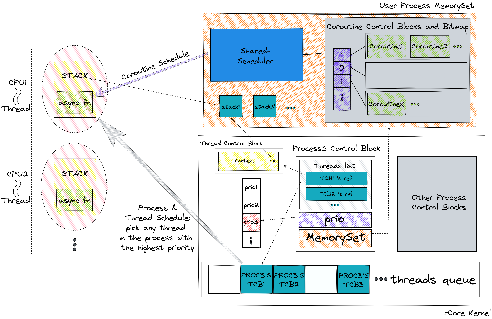
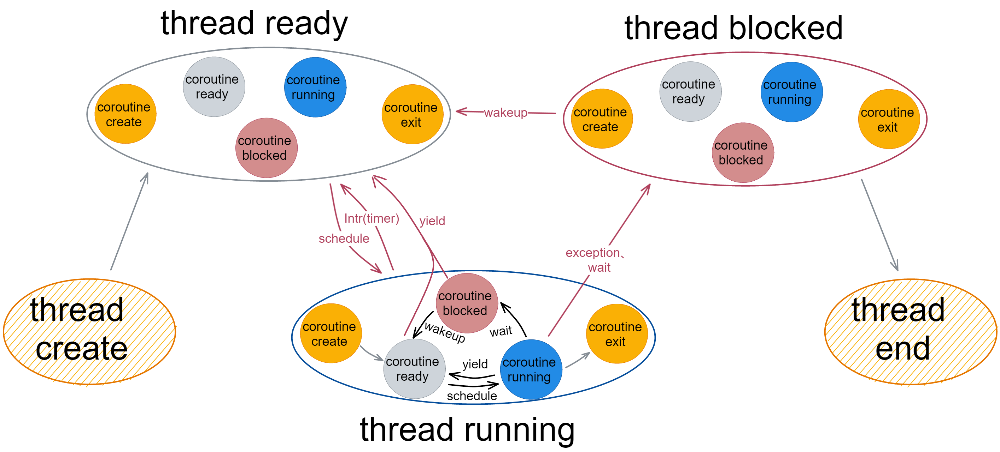
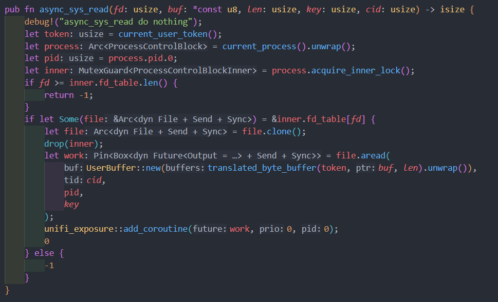
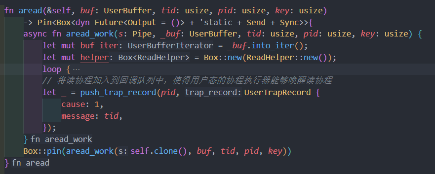
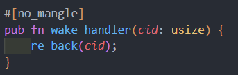
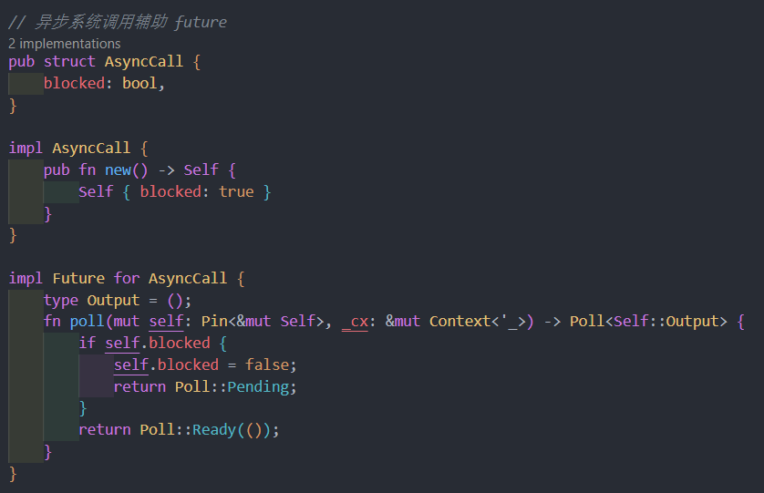
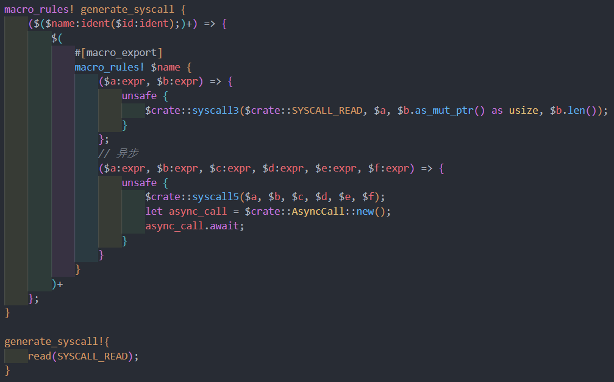
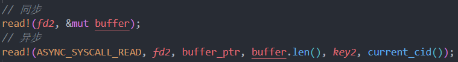

# 共享调度器技术报告

## 摘要

共享调度器项目的主要贡献在于，利用 Rust 语言对于协程机制的支持，将协程的概念引入到内核之中，将协程定义为最小的任务单元，为内核和用户进程提供一套协调的任务调度机制，并且对部分系统调用进行改造，为用户进程提供了一个完全异步的环境。

## 1 背景介绍

### 1.1 已有工作分析

#### 1.1.1用户态中断

在传统的操作系统中，我们常常使用内核转发的方式模拟信号传输，来进行进程间通信。发送信号的进程需要进入内核态进行操作，特权级的切换造成的性能开销将导致效率低下，而接收信号的进程往往需要等待下一次被调度时才能响应中断，这意味这信号不能被及时响应，导致延迟较高。用户态中断技术的出现，使得高效的信号传输成为可能。

“中断”的术语在之前常常用于描述源自硬件并在内核中处理的信号。即使是我们常用的软件中断（即软件产生的信号）也是在内核中处理的。但近几年出现的一种设计，希望处于用户空间的各个任务可以相互之间不通过内核，直接发送中断信号并在用户态处理。2020年，Intel在Sapphire Rapids处理器中首次发布x86的用户态中断功能，而2021年的Linux 在RFC Patch中提交了对用户态中断支持的代码，我们以用户态的信号传输为例，对用户态中断的优势进行分析。

在传统的多核系统中，运行在两个核心的用户进程通过信号进行通信时，发送端进程需要陷入内核，向接收端进程的信号队列中插入信号，等待接受进程下一次被调度时才能响应信号；而在支持用户中断的多核系统中，发送端可以直接通过硬件接口向接收端发送信号，而接收端在核上调度时会立即响应。

从上图可以看出，在最好的情况下（即发送端和接收端都在核上时），用户态中断下的信号传递不需要进入内核，而且接收端也会及时响应。

### 1.2 Rust 语言协程机制

## 2 项目整体介绍

（补充图片，项目涉及的几个部分）

## 3 任务调度与状态转换模型

### 3.1 任务调度

我们保留进程控制块（PCB）、线程控制块（TCB）等数据结构不变，进程仍然负责地址空间隔离，而线程不再与特定的某个任务（函数）进行绑定，而是被视为分配给某个进程的虚拟 CPU，负责运行协程的调度函数，提供给协程代码运行所需要的栈。

同时，使用协程控制块（CCB）来描述任务信息。图 2 展示了内核和用户进程地址空间内的数据结构。其中，PCB 和 TCB 处于内核地址空间中，由内核进行管理；CCB 处于内核和用户进程地址空间内的 Executor 数据结构中，由内核和用户进程各自对其进行管理。由于这些数据结构所处的地址空间不同，而要对任务进行调度，因此整个系统的运行需要进行两种调度：（1）由内核完成进程、线程调度；（2）内核、用户进程内部的协程调度。图 2 展示了这两种调度。

图2：内核、用户地址空间以及两种调度

#### 3.1.1 进程、线程调度

一般来说，进程、线程都需要进行调度，需要根据一定的策略，将 CPU 分配给处于就绪队列中的某个进程中的某个线程。在没有引入协程之前，线程绑定了特定的任务（函数），这个任务同样存在优先级，因此在进程调度完成之后还需要进行一次线程调度。

但是，基于上述对线程概念变化的描述，线程并不与某个具体的任务进行绑定，TCB 中不需要 prio 字段记录任务的优先级，所有线程都是等价的。因此，这一阶段不需要额外进行调度。我们将这两种调度合并在一起，由内核来完成，从所有线程的就绪队列中找到属于目标进程的位置最靠前的线程即可，如图 2 所示。

总体来说，进程、线程调度仍然需要以优先级作为依据，在进程初始化时，我们将进程的优先级设置为默认优先级，一旦进程开始运行，其优先级会动态变化，这种变化将会在协程调度中进行介绍。

#### 3.1.2 协程调度

利用 Rust 语言提供的 async/await 关键字，我们可以轻易的利用协程来描述任务，同时也是由于 Rust 语言的机制，我们必须要手动实现异步运行时（AsyncRuntime）使得协程能够运行。若以 lib crate 的形式提供依赖给内核和用户进程，那么在编译时，这些依赖会被编译进各自的 ELF 可执行文件中，使得内存空间开销增大，这显然是不明智的做法。为此，我们以共享库的形式将 Async Runtime 的依赖提供给内核和用户进程，即共享调度器（SharedScheduler）。它对外完全透明，仅仅暴露出一组接口供内核和用户进程使用，其内部集成了管理内核、用户进程各自 Executor 数据结构的操作和协程调度算法。

如图 2 所示，协程作为任务单元，每个协程都应该有各自的优先级，保存在协程控制块的 prio 字段中，SharedScheduler 采用了优先级位图来进行调度，位图中的每位 bit 对应着一个优先级队列，1 表示这个优先级的队列中存在就绪协程，0 表示这个优先级队列内不存在就绪协程。进行协程调度时，根据优先级位图，取出优先级最高的协程并更新位图，使其与进程内的协程的优先级始终保持一致。

上文提到的进程优先级动态变化与协程的调度相关。目前的实现是将进程优先级的实际意义理解为进程内协程的最高优先级，它记录在 SharedScheduler 内提供了一段共享内存中，实际上是优先级数组。在完成对内核或者用户进程内的协程的一次调度之后，SharedScheduler 会在优先级数组上对应的位置更新进程内协程的最高优先级。

### 3.2 状态转换模型

引入协程之后，任务的调度发生了变化，因此，相应的状态转换模型也产生了一系列变化。由于内核不感知协程，只负责进程、线程调度，线程的状态模型仍然是成立的。除此之外，我们还为协程建立了和线程类似的状态模型。由于协程调度建立在线程调度完成的基础上，因此协程的状态转换依附于线程的状态转换，却又会导致线程的状态发生变化，二者相互影响。如图 3 所示。

图3：线程、协程状态模型

#### 3.2.1 线程内部协程状态转换

当线程处于就绪和阻塞的状态时，其内部协程的状态不会发生变化。只有在线程处于运行状态，协程才会发生状态转换。通常，线程会由于内核执行了某些处理过程，从阻塞态恢复到就绪态时，线程内部的协程所等待的事件也已经处理完毕，此时协程理应处于就绪的状态，因此，需要用某种方式将协程的状态从阻塞转换为就绪态。我们通过用户态中断完成了这个过程，但是，用户态中断唤醒协程目前的实现实际上是新开了一个线程专门执行唤醒的操作，因此，协程状态发生变化还是在线程处于运行的状态。这里存在着二者相互影响的逻辑关系。

协程在创建之后进入就绪态，经过调度转变为运行态；在运行时，当前协程可能会因为等待某一事件而进入到阻塞态，也可能因为检测到存在其他优先级而让权，也可能会执行完毕进入退出状态；当协程处于阻塞的状态时，这时只能等待某个事件发生之后被唤醒从而进入就绪的状态。

#### 3.2.2 线程状态转换

在图 3 中，不仅仅描述了线程内部的协程状态模型，同时还描述了线程状态模型以及线程、协程状态转换的相互影响关系。从图中我们可以观察到，线程仍然具有创建、就绪、阻塞、运行和结束五种状态，其状态转换与上述 3.2.1 节类似。需要注意的是，尽管从内核的视角看来，造成线程发生状态转移的事件仍然是调度、让权、等待以及唤醒这几类。但是，线程内部的协程状态转换给这几类事件增加了新的起因。因此，造成线程状态变化的原因具体可划分为以下几类：
（1）与内部协程无关的外部事件。例如，无论内部的协程处于何种状态，都会因为时钟中断被抢占进入就绪态。
（2）与内部协程相关的外部事件。由于内核执行了某些处理过程，完成了线程内部协程所等待的事件，使得协程需要被重新调度，线程将会从阻塞态转换为就绪态。
（3）内部协程自身状态变化。一方面是协程主动让权，当上一个执行完毕的协程处于就绪或阻塞态，需要调度下一个协程时，若此时检测出其他进程内存在更高优先级的协程，这时会导致线程让权进入就绪态；另一方面是协程执行过程中产生了异常，导致线程进入阻塞态，等待内核处理异常。

然而，无论何种原因，一旦线程状态发生变化，就会发生线程切换。这种切换需要保存 CPU 上的所有寄存器信息，是比较低效的。

## 4 异步系统调用

协程，是一段可以暂停和恢复执行的函数。引入协程机制，是为了利用其异步的特性。若两个任务 A 和 B 被描述成同一线程中的两个协程，且 A 依赖 B，它们不需要进入到内核之中，仅仅在用户态完成。即使 A 的优先级较高，先执行，也可以通过暂停，使得 B 执行相应的任务之后再唤醒 A 继续执行。这个过程体现了协程的好处。

当上述条件不变，任务 A 和 B 仍然是同一线程中的两个协程，但它们两者都需要进入内核且存在依赖关系，当 A 先被调度执行系统调用进入到内核中，但 A 在内核之中的操作需要等待 B 完成之后才能够继续执行，由于内核里系统调用处理的操作是同步的，在这种场景下，就会阻塞无法运行。需要注意，当 A 和 B 被描述成两个线程时，上述场景提到的阻塞问题将不复存在。

要在上述的场景下发挥协程的作用，必须要使得协程执行系统调用进入内核之后马上返回用户态并暂停，等待它所依赖的任务完成之后，再被唤醒继续执行。为此，我们系统调用进行改造，使其支持异步。一方面，内核中的系统调用处理流程需要修改；另一方面，用户态系统调用接口需要进行功能和形式上的修改。

### 4.1 内核系统调用改造

对于内核系统调用改造，任务在进入内核系统调用处理函数之后，内核采取某种方式使得任务立即返回用户态，而不需要同步的等待相应的处理流程执行完毕再返回用户态。在内核异步的完成相应处理过程之后，再唤醒对应的用户协程。

#### 4.1.1 创建内核协程

以 sys_read 系统调用为例，进入内核之后，不再是同步的执行相应的处理流程。这些处理过程被封装成协程，而系统调用需要做的就是将这个内核协程添加到内核的 Executor 中，再返回到用户态。如图 4 所示。

图4：rCore-N async_sys_read 系统调用

#### 4.1.2 唤醒用户协程

异步系统调用返回到用户态之后，内核的处理流程被封装成协程，但并未执行，需要等待内核完成处理之后，才会被唤醒执行。内核执行这个协程，完成相应的处理过程之后，会发起用户态中断，传递需要唤醒的用户协程 ID，由用户态中断处理函数唤醒对应的协程。如图 5、6 所示。

图5：内核协程通过发送用户态中断

图6：用户态中断唤醒协程

### 4.2 用户态异步系统调用接口改造

对用户态系统调用接口的异步化改造，一方面需要考虑到功能上的差距，另一方面需要考虑到形式上的统一，尽可能缩小和同步系统调用的区别。此外还需要考虑改造过程中的自动化。

#### 4.2.1 功能上的改造

为了使得系统调用能够支持异步的特征，需要增加辅助的数据结构 AsyncCall，并按照 Rust 语言的要求为其实现 Future trait，完成这个工作之后才能够在调用系统调用时使用 await 关键字。见图 7。

图7：异步系统辅助数据结构

#### 4.2.2 形式上的改造

我们力求缩小形式上的差距，考虑到异步系统调用更加复杂，因此，采取的策略是同步系统调用向异步看齐，我们利用了 Rust 语言中的声明宏，帮助生成同步系统调用和异步系统调用。见图 8。

图8：声明宏生成同步、异步系统调用

最终，同步和异步系统调用在形式上达到高度统一，唯一的区别在于参数的不同。见图 9。

图9：同步、异步系统调用

## 5 模块化共享库与调度框架

因为 Rust 语言的特点，我们采取了模块化的形式来实现本项目，这一特点体现在 SharedScheduler 暴露的接口（共享库）以及协程调度框架上。

### 5.1 模块化共享库

我们以 bin crate 的模式生成 SharedScheduler，由内核将其加载进自己的地址空间中进行维护，并通过 vDSO 共享给所有用户进程，使得内核和所有用户进程可以访问 SharedScheduler 的代码。但是这种方式显然不如 lib crate 的形式便捷。内核和用户进程能够访问 SharedScheduler 中接口的权限，却不知道这些接口的入口地址，只能通过解析符号表查找对应的符号才可以使用。

为了解决查找符号表带来的麻烦，我们专门为 SharedScheduler 暴露的接口实现了一个共享库 ss-exposure，这个库采取 lib crate 的形式，并通过不同的 feature 向内核和用户暴露出不同的接口。暴露的接口如下表。

| 接口               | 功能                      | feature       |
| ------------------ | ------------------------- | ------------- |
| init               | 初始化函数调用接口        | kernel & user |
| user_entry         | 用户进程入口              | kernel        |
| spawn              | 添加协程                  | kernel & user |
| current_cid        | 获取当前正在运行的协程 ID | kernel & user |
| re_back            | 使目标协程重新入队        | user          |
| reprio             | 调整目标协程优先级        | kernel & user |
| poll_kernel_future | 调度并运行内核协程        | kernel        | 
表1：SharedScheduler 编程接口

### 5.2 模块化协程调度框架

我们通过 vDSO + ss-exposure 的方式，使得内核和所有的用户进程能够访问 SharedScheduler 暴露的共享库。但内核和用户进程使用这些库函数最终会落实到对其内部的 Executor 数据结构的操作上。为了避免在内核和用户库中重复定义 Executor 数据结构，我们将 Executor 定义在 ss-exposure 库中，并为其实现某些成员方法。

按照 Rust 的特性，仅仅在内核和用户进程中创建 Executor 而不使用其成员方法，那么内核和用户程序编译生成的 ELF 文件中将不会包含这些成员方法。而在 SharedScheduler 中，我们通过调用 Executor 的成员方法完成对它内部的操作。这样一种特性，使得我们既能保留住共享的特点，又能方便的实现模块化的协程调度框架，通过不同的 feature 使用不同的协程调度算法。

（这里应该还需要增加一张图片，描述 SharedScheduler 和 ss-exposure 中的层次关系，以及协程调度框架）

## 6 功能评价

### 6.1 串行的 pipe 环

#### 6.1.1 单线程测试的场景

#### 6.1.2 多线程下的测试加速比

### 6.2 独立的 pipe 模拟网络中的长连接

#### 6.2.1 不同优先级的吞吐量

### 6.3 线程与协程进行对比

## 7 未来展望

### 7.1 线程中执行的协程不是固定的，可能会导致多线程的情况下不能完全并行。尽管可以通过调整优先级使得某些协程固定在一个线程上执行。

### 7.2 CPU 让权的处理，会导致性能的下降，需要进行权衡

### 7.3 协程的错误处理

