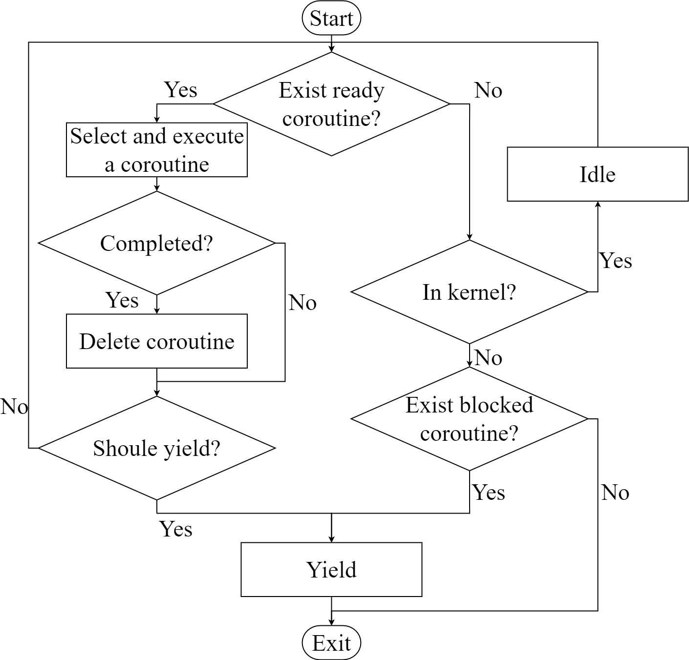

[toc]

中心论点：对进程、线程、协程的概念进行了新的尝试，并在这个基础上实现了共享调度器，给内核和用户程序提供了协程的异步运行时。

# SharedScheduler

### 论文大纲

### Abstract

简要描述全文的要点

### 1. Background and Motivation（先不考虑）

#### 1.1 高并发场景、嵌入式等受限制的设备上异步编程，使用无栈协程会更好

#### 1.2 Rust 只提供基本的 trait，不提供 runtime，而社区开发的第三方 runtime 多是基于 std 环境下，能在内核环境下运行的较少

#### 1.3 内核和用户程序进行异步编程都需要 runtime，因此有必要考虑到代码的重用性，因此通过 VDSO 的形式在内核和用户程序之间共享同一份代码

#### 1.4 rust async/await 模式

1. ##### 异步编程的发展趋势，在 设计文档里面有大致的趋势，之后再补充文献

#### 1.5 用户态中断

1. ##### x86 的用户态中断
2. ##### rCore-N

#### 1.6 rCore 多核

1. ##### 内核线程多核并行

### 2. Try new interpret the concept of task

> 本文的主要贡献之一是在引入了协程的概念之后，尝试对进程、线程等概念进行系统的解释。
>
> 进程最开始既需要负责隔离，又需要为运行的代码保存上下文，在多线程的模型中，进程是负责隔离，而线程则保存上下文。
>
> 而线程则有两种模型，一种是内核支持的线程、另一种是用户支持的线程。内核支持的线程在阻塞时，进程内的其他线程不会受到影响，而用户支持的线程，在某个线程阻塞时，其他的线程均被阻塞。
>
> 用户支持的线程模型更适合于协作式的任务，协程在用户支持的线程模型的基础上发展而来，可以分为有栈协程和无栈协程。而我们讨论的 Rust 的协程则是无栈的协程。毫无疑问，无栈的协程更加简洁轻便，不需要准备栈。但是无论是何种情况，都需要准备一个栈给代码运行，因此不得不将某个栈的栈顶保存在某个上下文中。若整个系统完全属于协作式的系统，则每个协程的上下文都由协程自己负责，这种方式与用户支持的线程的模型没有区别，仅仅是栈的内存使用的区别。对于实时性的需求，我们必须要支持抢占式，而内核支持的线程则是支持抢占的，因此我们保留了内核支持的线程模型。
>
> 上述对这些概念进行了分析之后，我们设计了整体的架构图如下。进程中最重要的两个数据结构是地址空间和线程链表，地址空间主要描述了进程的代码段、数据段等虚拟地址和物理地址的映射关系，负责地址空间隔离。线程链表则是记录了线程控制块的引用。线程控制块中保存了上下文的数据结构，这个上下文主要用于保存在某个 CPU 上运行的信息，这个上下文在支持抢占式的情境下非常有必要，内核的调度则是通过维护就绪的线程的链表进行。
>
> 线程上下文中的 sp 指针指向某个栈，为 rust 协程的运行提供了栈。任务的最小单位则是协程，一个协程在站上运行完毕或者阻塞后，其在栈上的信息会被换出，供下一个协程执行。

1. 突出进程地址空间隔离的作用
2. 内核支持的线程，记录了 CPU 的寄存器信息，可以支持抢占式多任务，提供了协程代码运行时需要的栈
3. rust 无栈协程，任务的最小单位，一个线程上运行多个协程（没有体现出来，没想好怎么画，在下面的图中体现出来了）

改进：

协程控制块在用户态、

不同的情况下，切换属于什么类型（进程切换：地址空间切换，内核决断；线程切换：切换栈，由线程依据当前的状态决断；协程切换：不切换栈）

内核线程、用户线程最终统一

### 3. A Completely Asynchronous Environment

#### 3.1 Overview

> 本项目的主要贡献除了对于进程、线程、协程的概念进行新的探讨，还基于 rCore-N 实现了一个基本的原型。
>
> 在完成内核其他模块的初始化之后，我们开始将共享调度器加载到内核之中，并建立地址映射关系，使得内核可以访问执行共享调度器的代码。当需要创建用户进程执行时，在解析 elf 建立地址空间时，我们会将共享调度器映射到进程的地址空间中，使得进程同样可以访问执行共享调度器代码，通过这种方式使得内核和所有的进程共享同一份代码。由共享调度器为协程提供一个异步运行时。

#### 3.2 共享调度器在更细程度上提供了异步的支持

##### 3.2.1 整体的架构、思路

> 整体的流程图如下。内核根据进程的 elf 格式文件，解析并创建地址空间，将共享调度器地址映射加载到进程地址空间之后，紧接着我们会创建一个线程控制块，线程控制块中的上下文会被初始化为空，sp 寄存器指向事先准备好的一个空栈的栈顶，pc 寄存器被设置为共享调度器的入口。当内核的调度代码选取出这个线程时，则 sret 进入用户态，进入到共享调度器代码 user_entry 函数，之后马上跳转到 user_lib 的用户程序代码，这也是在用户进程地址空间中，在这里完成堆，Executor 的初始化工作之后，控制流再回到 user_entry 函数（或许这样有一些奇怪）。在 user_entry 中，我们调用 poll_future 函数，这个函数的主要功能是不断从 Executor 中取出优先级最高的协程执行，这时控制权在 poll_future 函数和用户写的协程代码之间转移。在所有的协程运行结束之后，这也就意味着所有的任务已经完成，这时需要回收掉对应的进程、线程。

1. 读者通过这个图能够充分理解我们的框架
2. 突出任务执行的方式，不断从 Executor 中取出协程执行
3. 线程的接口，实现增减 CPU 的效果

地址空间的问题

user_entry 和 user_lib

调度决策（位图）、调度点（轮询、中断返回）

切换过程、保存恢复寄存器的范围

##### 3.2.2 调度方式（Bitmap，略写）

##### 3.2.3 内核和用户态的协调机制

> 在第二章我们提到了保留了内核线程的接口，在这里起到了很大的作用。

##### 3.2.4 系统调用接口

> 对同步系统调用接口进行更改，利用宏，使得使用的差距变小

### 4. Evalution

1. 串行的 pipe 环
   - 单线程下的测试不比学长的慢
   - 多线程下的测试加速比
2. 独立的 pipe 模拟网络中的长连接
   - 不同优先级的吞吐量
3. 线程与协程进行对比

### 5. Extension and limits

1. 线程中执行的协程不是固定的，可能会导致多线程的情况下不能完全并行。尽管可以通过调整优先级使得某些协程固定在一个线程上执行。
2. CPU 让权的处理，会导致性能的下降，需要进行权衡
3. 协程的错误处理
