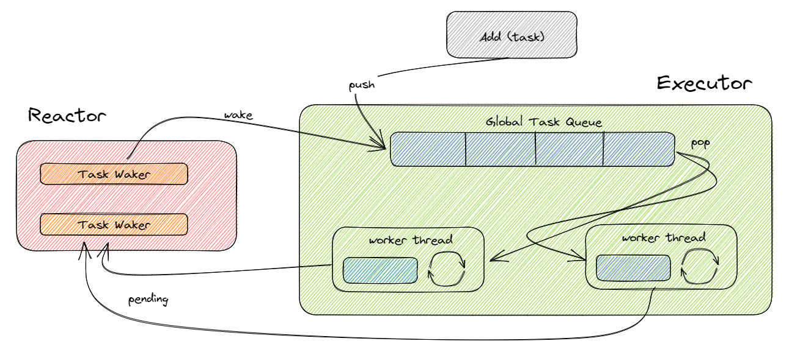
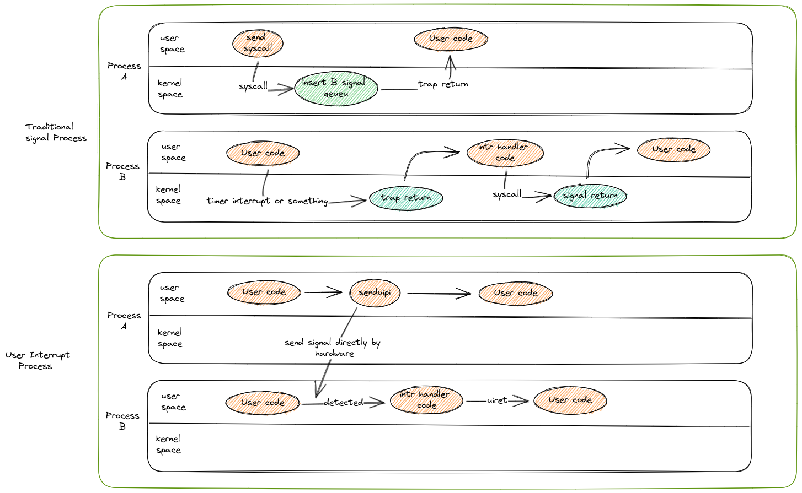
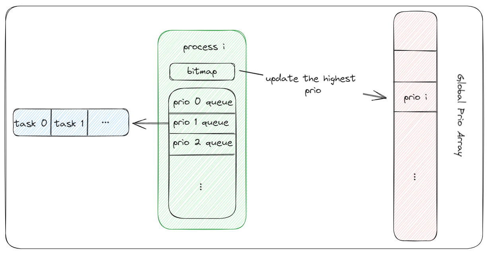
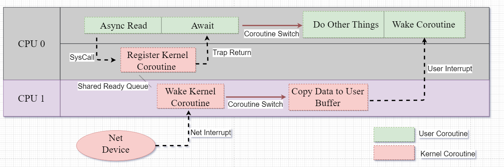
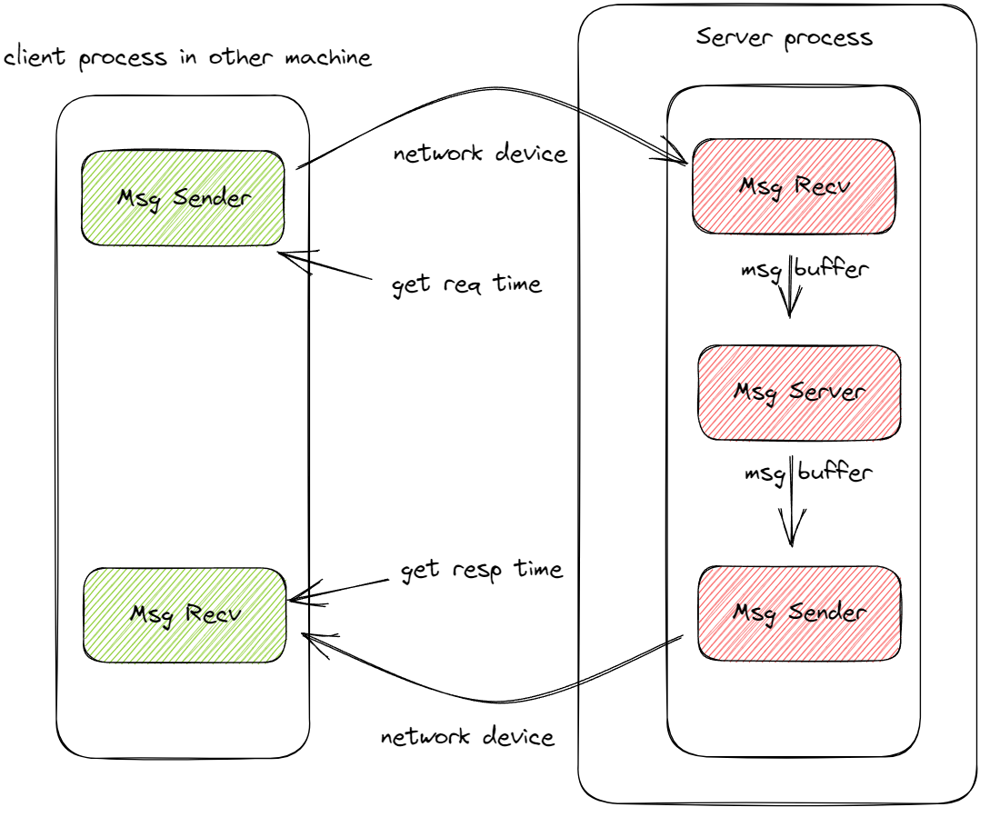
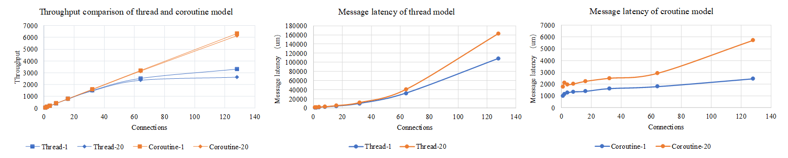
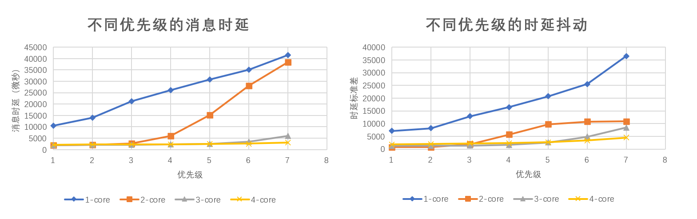
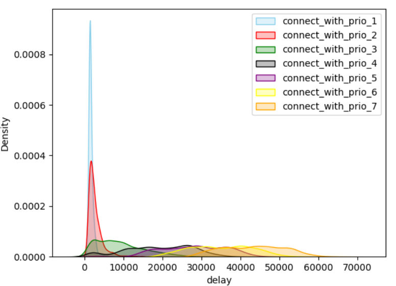

# Abstract

As a classical concurrency model, multi-threading technology has been widely supported by numerous operating systems and extensively applied in various application programs. However, as concurrency increases, the high system overhead and context-switching costs of multi-threading model have gradually become unacceptable. As a result, coroutines have emerged, but they often only have been supported by user-level  and are not recognized by the operating system, which led to the inability of the kernel to  estimate the workload of coroutine tasks in the system accurately to perform more precise scheduling to achieve higher system resource utilization. Based on these facts, we have conducted the following work: 1) We have taken coroutines as the basic unit of kernel scheduling and implemented more precise scheduling to enhance the overall resource utilization.2) And we have designed an $O(1)$ complexity priority scheduling algorithm that cleverly unifies coroutine scheduling and process scheduling.3) We have used user-level interrupts to asynchronously transform system calls, improving the efficiency of waking up asynchronous coroutines. Finally, we have compared the efficiency of the thread model and the coroutine model on Qemu and FPGA, and found that coroutines have much lower overhead than threads in terms of context switching.

# 1. Introduction

As of 2022, Google's servers are handling 893[1] billion requests per day, with an average of 8 million requests per second, posing a great challenge for both hardware and software. Handling such a large number of asynchronous requests cannot be supported solely by threads. Therefore, mainstream operating systems have provided certain support for user-level asynchronous tasks.

In the early days, Linux provided system calls such as [select and epoll](./bibtex_ref/epoll) to support user-level asynchronous I/O tasks by multiplexing multiple I/O operations on a single thread. The epoll operation uses a single thread to poll multiple listening ports, and when no event occurs, the polling operation will cause the polling thread to be block until an event arrives and wakes it up.  When an event occurs, the polling thread will copy the corresponding listening port from kernel space and send it to a separate thread for event processing. Windows I/O Completion Ports (IOCP) also provide a similar mechanism for I/O multiplexing. Unlike Linux, Windows IOCP calls the callback function in the completion thread for post-processing work after the completion of an I/O operation, making it a truly asynchronous I/O operation. Moreover, compilers and runtime libraries have built a set of independent scheduling systems in user space based on the asynchronous support provided by the operating system. In this system, the scheduling units are often referred to as coroutines and are only used by the user-space scheduler. Overall, although the kernel has provided some support for user-level asynchronous tasks, it can still only perceive a single listening thread working in the kernel and cannot truly perceive user-level asynchronous tasks, let alone finely allocate system resources according to the workload of each asynchronous task.

In addition to capturing execution errors in applications, the kernel also needs to handle high-privileged instructions such as device I/O operations. These events are not immediately triggered, and thus the kernel also requires a lightweight asynchronous task scheduling mechanism for performance optimization. [LXDs](./bibtex_ref/LXDs) has developed a lightweight asynchronous runtime environment in the kernel for cross-domain batch processing. This runtime environment allows lightweight processes to be created in the kernel that can execute tasks asynchronously, thereby improving system throughput and responsiveness. [Memif](./bibtex_ref/memif) is an operating system service for memory movement that provides a low-latency and low-overhead interface based on asynchronous and hardware-accelerated implementations. [Lee et al.](./bibtex_ref/lee) significantly improved application performance by reducing I/O latency through the introduction of an asynchronous I/O stack (AIOS) for the kernel. These approaches often propose an asynchronous task scheduling scheme that is independent of the kernel thread scheduler, which lacks generality and scalability and increases the complexity of the kernel.

Based on the above situation, we note that both kernel and user space require asynchronous task scheduling, and the scheduling characteristics are generally similar. Unfortunately, we have not found a unified and modular scheduling framework that can be provided to both user and kernel space.

- 介绍当前主流内核对用户态的异步支持，指出主流内核对异步支持的一些缺陷：
  - 当前主流的宏内核中，协程仍然作为一种用户态管理的调度单位（例如tokio），无法被内核感知到，内核无法从系统层面对协程进行精细化管理。
  - 内核中缺乏轻量级的异步任务调度方案。内核往往也需要处理如设备读写等异步任务，近年的工作往往是提出一套独立于内核线程调度之外的单独的异步任务调度方案，首先是没有很好的通用性，其次也增加了内核的复杂度。
  - 在内核和用户态都需要异步调度、且调度特征大体相似的情况下，没有一个统一的、模块化的调度框架同时提供给用户程序和内核。

# 2. Relative Work

This chapter will provide a brief introduction to some of the existing technologies and methodologies used in this paper.

#### Async Support In Rust

In its early stages, Rust supported stackful coroutines. However, to better address issues related to memory leaks and debugging, Rust discontinued support for stackful coroutines in version 1.0 and instead adopted an asynchronous programming model based on async/await. Starting in 2017, Rust began supporting stackless coroutines in its nightly version. In this article, all references to coroutines refer to stackless coroutines.

The Rust compiler has the capability to transform asynchronous functions into coroutines. By using the async/await syntax, the compiler can expand an asynchronous function into a state machine that suspends when the asynchronous operation is not complete and resumes when it is completed. This transformation is performed at compile time, ensuring both efficiency and safety at runtime.

It is worth to note that Rust compiler does not provide an asynchronous runtime, but only provides abstractions such as Future for task management, Waker for asynchronous wakeups, and async/await syntax for transforming functions into state machines. Third-party libraries often leverage these abstractions provided by Rust to implement their own asynchronous runtimes.



The Rust asynchronous programming model is illustrated in Figure 1.2. First, the user creates a task and adds it to the global task queue. Then, worker threads in the Executor continuously fetch tasks from the task queue and execute them, creating a waker to maintain the task's execution status. When a task needs to wait for an asynchronous message, the waker is placed in the corresponding Reactor for the message and the worker thread executes other tasks. When the asynchronous message arrives in the Reactor, it finds the corresponding waker and uses the wake operation to re-add the corresponding blocking task to the task queue.

#### User-Space Interrupt Support

In traditional operating systems, signals are often transmitted between processes through the kernel. The sending process needs to enter kernel mode to attach the signal to the receiving process, and the performance overhead caused by the privilege level switch can lead to low efficiency. The receiving process often needs to wait until the next scheduling to respond to the interrupt, which means that the signal cannot be responded to in a timely manner, resulting in high latency. The emergence of user-space interrupt technology has made efficient signal transmission possible.

The term "interrupt" has traditionally been used to describe signals that originate from hardware and are processed in the kernel. Even the software interrupts we commonly use (i.e., signals generated by software) are also processed in the kernel. However, in recent years, a design has emerged that allows tasks in user space to send interrupt signals to each other without going through the kernel, and to process them in user space directly. In 2020, Intel introduced the x86 user-space interrupt feature in the Sapphire Rapids processor, and in 2021, Linux submitted code for user-space interrupt support in an RFC patch. Taking user-space signal transmission as an example, we analyze the advantages of user-space interrupts.



In traditional multi-core systems, when user processes running on two cores communicate through signals, the sending process needs to enter the kernel to insert the signal into the signal queue of the receiving process, and wait for the receiving process to respond to the signal until it is next scheduled. However, in multi-core systems that support user-space interrupts, the sending process can directly send signals to the receiving process through a hardware interface, and the receiving process can respond immediately when scheduled on the core. As shown in Figure 1.1, in the best case scenario (i.e., when both the sender and receiver are on the same core), signal transmission in user-space interrupts does not require entering the kernel, and the receiving end can respond immediately.

- Rust异步编程的机制介绍。
  - 有栈协程和无栈协程的对比。
- 用户态中断技术的介绍
  - 基本原理。
  - 与共享调度器的异步唤醒相结合。

# 3. Design

正如前面提到的问题，以及目前成熟的条件，我们认为也许能够利用协程实现更细力度的任务调度机制，从而减少开销，更好的进行系统资源分配。本文设计了一套以协程为单位的调度系统。它具有以下几个特点：

1）统一：内核调度与用户态任务调度相统一

2）共享：内核与用户态通过 vDSO 共享

3）兼容：与原有多线程模型兼容

## 3.1 System Architecture

系统架构如图所示，我们将协程添加进内核之中，让协程成为任务调度单位。共享调度器被映射到各自的地址空间中，内核以及用户进程完成初始化之后，进入共享调度器的调度代码，根据内部的优先级以及全局优先级完成协程调度。

## 3.2 进程、线程与协程

协程成为任务调度单位，因此进程、线程的概念存在一定变化。首先，需要将内核视为一个特殊的进程，再加上使用双页表机制，陷入内核和返回用户态均需要切换地址空间，因此进程的职责就变得明确，它负责管理地址空间。而线程的职责则发生较大变化，通常情况下，它不与具体任务进行绑定，只循环执行共享调度器的调度代码，只在有需要时，才会与具体的任务绑定起来，线程的职责主要是提供一个运行栈。而协程则是任务单位。

各个概念的关系已经清晰，而 CPU 在某个时刻，可能属于某个线程或者某个协程，线程与协程之间存在着相互影响的关系，因此我们重新定义了状态转换模型。（详细描述状态转换）

引入协程之后，内核进程中的任务完全由协程组成，而传统模型下进程、线程切换只能由一段汇编代码来完成，而这段代码往往没有明确的定义。在新的模型下，进程、线程切换只能通过协程来完成，因此我们定义了一个特殊的内核协程——“切换协程”来负责进程、线程切换，这也帮助明确了进程、线程切换代码的定义。

除此之外，对于用户程序，我们仍然与多线程模型兼容，提供了多线程相关的接口。

## 3.3 优先级机制

详细描述全局优先级与局部优先级，局部优先级由进程自己来维护，而全局优先级由所有的用户进程与内核进程通过共享调度器进行维护。

# 4. Implementation

我们在第三节中详细介绍了共享调度器的核心设计思路，而这一节，我们将介绍在实现过程中的细节问题。

This chapter discusses some implementation details regarding the shared scheduler.

### 4.1 Global priority and local priority. （放在 design 中）

In the shared scheduler, each process (with the kernel as a special process) maintains a coroutine queue, and each coroutine has its own priority. We consider the highest priority within a process as the priority of this process. Additionally, a global priority array is maintained in the system to record the priorities of all processes. The global priority is used to select the appropriate process for scheduling coroutines. When a process is selected for execution, using `poll` as the entry function will select the highest priority coroutine within that process for execution.coroutine within that process for execution.



It is important to consider the timing of updating local and global priorities. The following are some important timing considerations for updating priorities:

- **coroutine spawn**: When a new coroutine is added to the ready queue, it is important to update the local priority bitmap and to check for any changes in the highest priority. If the highest priority has changed, the global priority array should be updated accordingly.
- **fetch**: When a coroutine is removed from the ready queue, it is important to update the local priority bitmap accordingly. Since the coroutine has not yet started its execution, there is no need to update the global priority array.
- **re_back**: When a coroutine in pending state is awakened, it is important to check and update the local priority bitmap, and to check for any changes in the highest priority. If the highest priority has changed, the global priority array should be updated accordingly.

### 4.2 Asynchronous system calls

Synchronous system calls, such as "read", block the entire thread. In a fully asynchronous coroutine programming environment, it is necessary to transform system calls into asynchronous operations to ensure that they only block the current coroutine at most. The support for asynchronous system calls mainly involves two parts: user space and kernel space.

#### User Space

The modification of the user space system call interface to support asynchronous calls needs to consider both functional differences and the need for formal consistency. There should be an effort to minimize the differences from synchronous system calls. Additionally, automation should be considered throughout the modification process.

To enable system calls to support asynchronous features, an `AsyncCall` auxiliary data structure needs to be added, and the Future trait should be implemented for it according to Rust language requirements. After completing this work, the `await` keyword can be used when calling system calls.

The formal differences should be minimized as much as possible. We use Rust language procedural macros to generate both synchronous and asynchronous system calls. In the end, synchronous and asynchronous system calls achieve a high degree of formality consistency, with the only difference being the parameters. The format is shown in the table below.

```rust
#[async_fn(true)] 
pub fn read(fd: usize, buffer: &mut [u8], key: usize, cid: usize) -> isize {
	sys_read(fd, buffer.as_mut_ptr() as usize, buffer.len(), key, cid) 
}

#[async_fn]
pub fn write(fd: usize, buffer: &[u8], key: usize, cid: usize) -> isize { 
	sys_write(fd, buffer.as_ptr() as usize, buffer.len(), key, cid) 
}

read_fd!(fd, buffer, key, current_cid); // async call
read_fd!(fd, buffer); // sync call
```

#### Kernel Space

In addition to ensuring formal consistency in the user-level system call interface, we also aim for consistency in the kernel system call processing interface. Ultimately, the kernel determines whether to execute synchronous or asynchronous processing logic based on the system call parameters. In the case of asynchronous processing, the kernel uses some method to immediately return the task to user space without waiting for the corresponding processing flow to complete synchronously. Once the kernel completes the corresponding asynchronous processing, it wakes up the corresponding user-level coroutine.

For instance, the following diagram illustrates the entire process of an asynchronous system call for socket read operation. After entering the kernel, if an asynchronous process is executed, the synchronous process in the kernel is encapsulated into a kernel coroutine, which is then added to the kernel executor. The process then returns to user space and generates a future to wait for the waking up of the user coroutine that executes the asynchronous system call. The user's executor then switches to execute the next user coroutine. After the asynchronous system call returns to user space, the kernel's processing flow is encapsulated into a coroutine, but it is not executed. The coroutine waits for the network driver to notify the kernel after the data is ready, and then the kernel coroutine is awakened to execute the corresponding processing. Once the kernel finishes the processing (in this case, copying data to the user space buffer), it generates a user space interrupt, passing the ID of the corresponding coroutine to be awakened. The user space interrupt handler then wakes up the corresponding coroutine.



### 4.3 Completely asynchronous scheduling environment

To achieve better uniformity in coroutine scheduling, we have carried out compatibility adaptations on the previously Unix-like runtime environments in both user mode and kernel mode. We have provided a completely asynchronous scheduling environment for both user and kernel modes.

In user mode, each process will be initialized using the shared scheduler environment initialization function. After initialization, the main function provided by the user program will be encapsulated into an asynchronous coroutine (which is equivalent to a synchronous task that cannot be awaited) and added to the ready queue for unified scheduling. In the end, all tasks in user mode are executed under the scheduling of the shared scheduler.

In kernel mode, the original scheduling task used to schedule user-mode processes is also encapsulated as a kernel scheduling coroutine, which participates in scheduling along with other ordinary kernel coroutines.Since the scheduling of user processes is synchronous, when encapsulating it as a scheduling coroutine, it is necessary to manually block and switch to other kernel coroutines.

### 4.4 How to share scheduler code between kernel and user mode

- 局部优先级和全局优先级。
- 异步系统调用实现
  - 接口改造
  - 异步系统调用的唤醒机制实现（结合用户态中断）。
- 兼容性实现
  - 用户态的代码入口为调度器初始化代码，为用户提供完全异步的环境。
  - 内核态的线程调度和协程调度的统一。
- 模块化调度器，用vdso在用户态和内核态复用了同一套调度代码。

# 4. Performance Evaluation

To demonstrate the lower switching overhead of coroutine programming model compared to thread programming model, we constructed two different TcpServer models using coroutine and thread respectively to test the server's throughput, message latency, and latency jitter.

In addition, we will demonstrate the significant role of priority in ensuring the real-time performance of certain specific tasks under limited resources by analyzing the impact of coroutine priority on task throughput, message latency, and latency jitter in the TcpServer experiment.

We implemented the shared scheduler based on rCore, which is a small operating system almost entirely written in Rust, characterized by its compactness and efficiency. It can also fully leverage Rust's support for asynchronous programming to quickly implement the shared scheduler.(需要介绍用户态中断的硬件环境)

The test scenario for TcpServer is shown in the following figure. The Msg Sender in the client sends data of a certain length to the server at regular intervals, while the Msg Recv in the client receives responses from the server, times the response time according to the timer, and waits for the timer to expire before sending the next request after receiving a response. Each connection in the server consists of three components:

- Msg Recv, which sends the received message to the request message queue.
- Msg Server, which takes messages from the request message queue, performs matrix operations, and sends the results to the response message queue.
- Msg Sender, which takes responses from the response message queue and returns them to the client.



These three components transfer data through a shared message buffer.

## 4.1 Coroutine programming model vs. thread programming model

To evaluate the advantages and disadvantages of the coroutine and thread programming models, as well as the switching overhead between them, we implemented the three components of the Server Process using the thread model and the coroutine model respectively. We represent the test results for processing 1 × 1 matrix requests in the thread model as Thread-1, and the test results for processing 20 × 20 matrix requests in the coroutine model as Coroutine-20. Similarly, the other results are represented accordingly. The experiments were conducted on 4 physical CPUs, with the server allocating 4 virtual CPUs. The client sent requests at a frequency of 100ms.

The test results for message latency are shown in the following figure. As can be seen from the figure, the thread model has similar or even slightly lower message latency than the coroutine model when the number of connections is small. This is because when the number of connections is small, the kernel can directly schedule threads to execute tasks, while the coroutine model adds an extra layer of synchronization and mutual exclusion operations in the scheduler, resulting in slightly higher latency. As the number of connections increases, the delay of the thread model rapidly increases and is much higher than that of the coroutine model. This is because most coroutine switches do not need to trap into the kernel, only switching the function stack, resulting in much smaller switching overhead than threads. Comparing different matrix request sizes under the same model, it is found that the larger the matrix size, the higher the latency, which is due to the larger overhead of message sending and receiving and message processing for larger matrix requests, leading to an expected increase in latency.



The figure also shows the test results of the total throughput for different matrix request sizes under different models. It can be seen that the total throughput of the server under the coroutine model increases linearly with the increase of the number of connections, even when the matrix request size increases. Since the load has not reached the peak (the client sends a request every 100ms, and the highest latency shown in the figure is only 10ms), the throughput depends on the number of connections and the client's request frequency. For the server under the thread model, it can keep up with the coroutine model when the number of connections is small, but as the number of connections increases, the switching overhead increases rapidly, leading to a slowing down of the total throughput increase trend. As for Thread-20, the load almost reaches its peak when the number of connections is around 64.

## 2.2 Priority-controlled resource allocation

In computer systems, both CPU and IO resources are always limited. Under such resource constraints, we can prioritize certain services by setting their priority levels. In the context of a TcpServer, we can set the priority levels of each connection in a hierarchical manner to ensure lower latency and reduced latency jitter for certain connections.

Our experiments were conducted on four physical CPUs. The clients sent request messages with a matrix size of 20x20 at a frequency of 50ms. The server was implemented using coroutines. We established 128 connections between the clients and server, divided equally among 8 priority levels, and tested the performance of the connections with different priority levels under different numbers of virtual CPU.

The test results are shown in the figure below, where "x-core" in the legend represents the number of virtual CPU cores allocated to the server. The results indicate that under resource constraints, only connections with higher priority levels (lower priority numbers) are able to achieve higher throughput and lower request latency. With the increase in resource quantity, the system is able to ensure that connections with lower priority levels also achieve higher throughput and lower latency, while still adhering to the requirement that the highest priority level has the highest throughput and lowest latency. Furthermore, we also observed that with the increase in virtual cores, there was a slight performance degradation for high-priority connections. This is due to the increased synchronization and mutual exclusion among poll threads in the scheduler caused by the increase in virtual cores. In the future, this issue can be alleviated by introducing multi-level ready queues.



We further analyzed the distribution of message latency for each priority level, as shown in the figure below. This largely conforms to the characteristics of prioritizing high-priority connections in request handling.



1. 用户态和内核态的优先级串口实验。
2. WebServer实验。
   1. 协程的切换开销远低于线程。
   2. 优先级在资源有限的情况下，保证某些任务能够高效完成。

# 5. Conclusion

- 总结本文工作，重申实验结论。
  - 将协程作为内核衡量调度的因素，提升系统资源的整体利用率。
  - 协程优先级。
  - 利用用户态中断对IO系统调用进行了异步化改造。
  - 实验结论。
