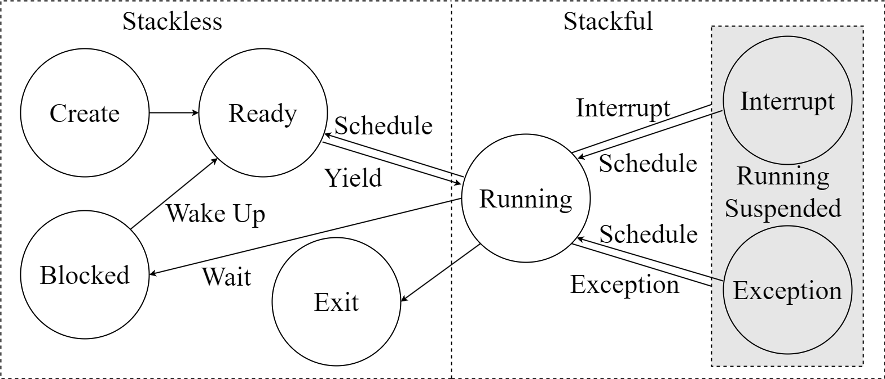

# Abstract

As a classical concurrency model, multi-threading technology has been widely supported by numerous operating systems and extensively applied in various application programs. However, as concurrency increases, the high system overhead and context-switching costs of multi-threading model have gradually become unacceptable. As a result, coroutines have emerged, but they often only have been supported by user-level  and are not recognized by the operating system, which led to the inability of the kernel to  estimate the workload of coroutine tasks in the system accurately to perform more precise scheduling strategy to achieve higher system resource utilization. Based on the above situation, we have carried out the following work: 1) We have designed a coroutine control block that allows both the kernel and applications to be aware of the coroutine's state, serving as the fundamental unit for kernel scheduling.2) We have introduced the concept of priorities within coroutines and designed a unified set of priority-based scheduling algorithms for both user-level and kernel-level coordination. 3) Finally, we analyzed the characteristics of the priority-based coroutine scheduling algorithms on QEMU and FPGA platforms, concluding that the coroutine scheduling algorithms has advantages in terms of switch overhead and granularity of resource utilization control.

# 1. Introduction

In the early days, operating systems introduced the abstraction of processes to meet the concurrency and isolation requirements of multiprogramming. However, due to the large resource granularity of processes and the high cost of inter-process communication, operating systems proposed the abstraction of threads as the basic scheduling unit. Threads share the same address space, enabling efficient communication among them. With the rapid increase in concurrency, the use of threads as concurrency units has gradually become unacceptable in terms of resource utilization. As of 2022, Google's servers are [handling 893 billion requests per day](./bibtex_ref/google10search), with an average of 8 million requests per second, posing a great challenge for both hardware and software. Handling such a large number of asynchronous requests cannot be supported solely by threads. In addition, as resource-constrained embedded devices become [increasingly commonplace in various fields](./bibtex_ref/mahbub2020iot) such as agriculture, education, and healthcare, the abstraction of threads still appears somewhat bloated in such devices. In scenarios with high concurrency or resource constraints, the industry has provided some solutions in both operating systems and programming languages. 

Linux provided system calls such as [select and epoll](./bibtex_ref/epoll) to support user-level asynchronous I/O tasks by multiplexing multiple I/O operations on a single thread. The epoll operation uses a single thread to poll multiple listening ports, and when no event occurs, the polling operation will cause the polling thread to be block until an event arrives and wakes it up.  When an event occurs, the polling thread will copy the corresponding listening port from kernel space and send it to a separate thread for event processing. Windows [I/O Completion Ports (IOCP)](./bibtex_ref/IOCP) also provide a similar mechanism for I/O multiplexing. Unlike Linux, Windows IOCP calls the callback function in the completion thread for post-processing work after the completion of an I/O operation, making it a truly asynchronous I/O operation. Although I/O multiplexing technology can effectively reduce thread resource waste, from the kernel's perspective, the poll thread is just an ordinary thread participating in regular scheduling, and the kernel cannot perceive the asynchronous tasks aggregated in the poll thread. Furthermore, I/O multiplexing forces user-level applications to adopt the producer-consumer model for handling asynchronous tasks, reducing the flexibility of user-level operations. [Native AIO](./bibtex_ref/nativeAIO) is a set of asynchronous I/O interfaces supported by the kernel, which avoids frequent switching and data copying between user space and the kernel. However, because it requires kernel support, it can only be used on specific operating system architectures and has poor compatibility. IO_uring is a relatively recent technology that adopts an innovative asynchronous method, allowing for the direct submission of IO requests in user mode, thus eliminating the need for context switches between user and kernel spaces. Additionally, it utilizes shared memory between user and kernel modes to prevent memory copying, thereby enhancing IO processing efficiency and throughput. However, excessive design has led to an increase in kernel complexity and a greater difficulty in utilizing the interface.

Moreover, compilers and runtime libraries have built a set of independent scheduling systems in user space based on the asynchronous support provided by the operating system. [Stackful coroutine](./bibtex_ref/revisitingcoroutine) such as goroutine , is an independent asynchronous runtime environment built on top of an operating system, which has lower context switching overhead than kernel threads and less invasive impact on the code. However, the fixed stack size allocation in stackful coroutines may lead to the wastage of stack memory. [Stackless coroutines](./bibtex_ref/survey)utilize state machines, which are usually automatically generated by the compiler, to share the function stack with the caller, further reducing the overhead of context switching and minimizing memory wastage. Additionally, the language-based stackless coroutine mechanism is highly developer-friendly, minimizing the potential for programming errors as much as possible. [POSIX AIO](./bibtex_ref/posix-aio) is a set of asynchronous I/O interfaces implemented in user space through the POSIX thread interface, which is compatible with different architectures and operating systems that support the POSIX standard. Since the kernel is not aware of asynchronous tasks, there are significant overheads, including thread creation, scheduling, destruction, I/O buffer copying, and context switching cross domain. There has been considerable work on coroutines and asynchronous runtimes in user mode. However, these implementations are built on top of the kernel, making it difficult for the kernel to perceive coroutines in user mode, consequently preventing the kernel from performing fine-grained resource scheduling.

In addition to capturing execution errors in applications, the kernel also needs to handle high-privileged instructions such as device I/O operations. These events are not immediately triggered, thus the kernel also requires a lightweight asynchronous task scheduling mechanism for performance optimization. [LXDs](./bibtex_ref/LXDs) has developed a lightweight asynchronous runtime environment in the kernel for cross-domain batch processing. This runtime environment allows lightweight processes to be created in the kernel that can execute tasks asynchronously, thereby improving system throughput. [Memif](./bibtex_ref/memif) is an operating system service for memory movement that provides a low-latency and low-overhead interface based on asynchronous and hardware-accelerated implementations. [Lee et al.](lee2019asynchronous,.md) significantly improved application performance by reducing I/O latency through the introduction of an asynchronous I/O stack (AIOS) for the kernel. [PM-AIO](./bibtex_ref/Pm-aio) indicates that the Native AIO path appears as a pseudo-asynchronous IO in the PM file system, and true asynchronous AIO is achieved by splitting IO requests into different sub-files. Due to the lack of coroutine support within the kernel, these approaches often propose asynchronous task scheduling schemes that are independent of the kernel thread scheduler, resulting in a lack of generality and scalability, as well as increased kernel complexity.


Based on the aforementioned discussion, we can summarize the following issues in the current state of asynchronous task scheduling in the industry:
1. The kernel provides basic abstractions such as processes and threads, but for high-concurrency and resource-limited scenarios, these abstractions may not be lightweight enough.
2. Lightweight runtimes provided in user mode, such as stackless coroutines, cannot be directly perceived and scheduled by the kernel, leading to the kernel's inability to precisely control resource allocation.
3. Some asynchronous tasks within the kernel itself (such as cross-domain communication in LXDs) are built as separate runtimes within the kernel, lacking a unified scheduling framework.

Therefore, based on the aforementioned issues, we propose our shared scheduler, which introduces lightweight coroutines with priority into both the kernel and applications, serving as the kernel's fundamental scheduling unit. This provides a unified scheduling framework for all asynchronous tasks within the kernel. Additionally, it enables the kernel to perceive the priority of user coroutines, allowing for fine-grained scheduling of user coroutines and ensuring precise allocation of system resources.

# 2. Background And Motivation

In order to enhance the performance of I/O-intensive applications, such as network applications and disk I/O applications, both the kernel and user space provide certain levels of asynchronous support. This chapter primarily focuses on widely used user-space coroutine technology and kernel-level I/O multiplexing technology in the industry.

## 2.1 Coroutine

Coroutine is a lightweight concurrency programming technique that enables cooperative scheduling of multiple execution flows within a single thread. Compared to traditional threads or processes, coroutines have lower resource overhead and higher execution efficiency. Coroutines can be seen as user-level threads that are actively controlled by programmers for scheduling and context switching.

Goroutine is a coroutine implementation in the Go programming language, based on the stackful coroutine model. Goroutine simplifies and enhances concurrent programming, allowing for a large number of concurrent executions within a single thread. In the Go language, Goroutines are created using the "go" keyword followed by a function call. This function call runs concurrently with other Goroutines in the same address space. Goroutines have their own stack space, which is dynamically allocated and managed by the Go runtime. This stack space enables Goroutines to have independent execution contexts, including local variables and function calls.

Coroutines in the Rust language are implemented through the async/await syntax, the async keyword, and the corresponding runtime library. Compared to goroutines, Rust coroutines are implemented as stackless coroutines, which do not require pre-allocated fixed-sized stack space. Instead, the stack space for coroutines is dynamically allocated and deallocated as needed. This allows coroutines to be created and destroyed very lightweightly and efficiently. Furthermore, thanks to the rigorous checking mechanisms of the Rust compiler, Rust coroutines also possess significant advantages in terms of memory safety. These are two reasons why we prefer Rust coroutines.

However, we have noticed that at the application layer, coroutine implementations cannot be directly recognized by the kernel. Specifically, the kernel can only perceive the processes and threads of user programs. In an extreme scenario, a process with thousands of coroutine tasks may appear no different to the kernel than a thread with just a single coroutine task. In order to enable the kernel to make appropriate resource allocations based on the actual workload of tasks, it becomes necessary to make the kernel aware of the presence of user coroutines.

## 2.2 Asynchronous tasks in kernel

In the kernel of an operating system, asynchronous tasks refer to tasks that can be executed in the background without blocking the main thread or other tasks. Asynchronous tasks are typically executed in an event-driven manner, where the kernel initiates corresponding asynchronous tasks to handle specific events when they occur. The kernel only provides an abstraction for threads in its design, but it is impractical to allocate a separate kernel thread for each asynchronous task. Some efforts have been made to handle asynchronous tasks in the kernel by building a lightweight thread runtime specifically for that purpose, such as cross-domain communication in LXD. However, this approach fails to provide a unified scheduling mechanism for regular threads and lightweight threads within the kernel, leading to increased complexity in kernel scheduling.

Another widely used technique is I/O multiplexing, which allows a thread to monitor multiple IO events, such as read and write operations on network sockets or the readiness state of file descriptors, without having to create separate threads or processes for each IO operation. However, to ensure prompt event responsiveness, the event loop thread often refrains from engaging in any additional time-consuming operations. Instead, it typically dispatches events to other threads for processing. This practice compels application developers to adopt the producer-consumer model for event distribution.

We have designed a simple network scenario where multiple clients need to send a local matrix to a server for time-consuming computations, and then receive the computed result back from the server. One widely adopted solution in the industry involves the use of IO multiplexing techniques on the server-side. This solution utilizes a poll thread to monitor the sockets of all connected clients. Upon receiving a request message, the poll thread directly sends it to a message queue. Subsequently, another processing thread continuously retrieves requests from the message queue, handles them, and returns the corresponding responses. This architecture represents a classic example of the producer-consumer model. The data race issue arising from the producer-consumer model often poses certain demands on the proficiency of application programmers.

We have observed that due to the coarse granularity of kernel thread resources, IO multiplexing chooses to aggregate multiple IO listening events into a single thread, which inevitably leads to event dispatching. To fundamentally address this issue, we introduce coroutines with finer resource granularity into the kernel, making them the smallest units for listening to IO ports and participating in unified kernel scheduling. Kernel coroutines correspond one-to-one with user coroutines, thereby eliminating the necessity for event dispatching at its core.


#### <!--Async Support In Rust-->

<!--In its early stages, Rust supported stackful coroutines. However, to better address issues related to memory leaks and debugging, Rust discontinued support for [stackful coroutines in version 1.0 and instead adopted an asynchronous programming model based on async/await](./bibtex_ref/rust-async). Starting in 2018, Rust began supporting stackless coroutines in its nightly version. In this article, all references to coroutines refer to stackless coroutines.-->

<!--The Rust compiler has the capability to transform asynchronous functions into coroutines. By using the async/await syntax, the compiler can expand an asynchronous function into a state machine that suspends when the asynchronous operation is not complete and resumes when it is completed. This transformation is performed at compile time, ensuring both efficiency and safety at runtime.-->

<!--It is worth to note that Rust compiler does not provide an asynchronous runtime, but only provides abstractions such as Future for task management, Waker for asynchronous wakeups, and async/await syntax for transforming functions into state machines. Third-party libraries often leverage these abstractions provided by Rust to implement their own asynchronous runtimes.-->

<!---->

<!--The Rust asynchronous programming model is illustrated in Figure 1.2. First, the user creates a task and adds it to the global task queue. Then, worker threads in the Executor continuously fetch tasks from the task queue and execute them, creating a waker to maintain the task's execution status. When a task needs to wait for an asynchronous event, the waker is placed in the corresponding Reactor for the message and the worker thread executes other tasks. When the asynchronous event arrives in the Reactor, it finds the corresponding waker and uses the wake operation to re-add the corresponding blocking task to the task queue.-->

#### <!--User-Space Interrupt Support-->

<!--In traditional operating systems, signals are often transmitted between processes through the kernel. The sending process needs to enter kernel mode to attach the signal to the receiving process, and the performance overhead caused by the privilege level switch can lead to low efficiency. The receiving process often needs to wait until the next scheduling to respond to the signal, which means that the signal cannot be responded to in a timely manner, resulting in high latency. The emergence of user-space interrupt technology has made efficient signal transmission possible.-->

<!--The term "interrupt" has traditionally been used to describe signals that originate from hardware and are processed in the kernel. Even the software interrupts we commonly use (i.e., signals generated by software) are also processed in the kernel. However, in recent years, a design has emerged that allows tasks in user space to send interrupt signals to each other without going through the kernel, and to process them in user space directly. In 2020, Intel introduced the [x86 user-space interrupt feature](./bibtex_ref/intel-white-paper) in the Sapphire Rapids processor, and in 2021, Linux submitted code for user-space interrupt support in an [RFC patch](./bibtex_ref/uint). Taking user-space signal transmission as an example, we analyze the advantages of user-space interrupts.-->

<!--In traditional multi-core systems, when user processes running on two cores simultaneously communicate through signals, the sending process needs to enter the kernel to insert the signal into the signal queue of the receiving process, and wait for the receiving process to respond to the signal until it is next scheduled. However, in multi-core systems that support user-space interrupts, the sending process can directly send signals to the receiving process through a hardware interface, and the receiving process can respond immediately when scheduled on the core. In the best case scenario (i.e., when both the sender and receiver are both running on different cores), signal transmission in user-space interrupts does not require entering the kernel, and the receiving end can respond immediately.-->

# 3. Design

In this section, we will introduce a kernel design scheme suitable for highly concurrent, asynchronous scenarios. It builds and improves on the traditional multi-process, multi-threaded model by replacing the task unit with a more lightweight coroutine, and bring it into the kernel to replace the responsibilities of the original thread. The design has the following four key enabling techniques, i.e., using coroutine control blocks to describe basic task units (Section 3.1), weaking the concept of thread and constructing  a coroutine state transition model (Section 3.2), using kernel coroutines (section 3.3), harmonizing task scheduling between the kernel and user processes by share schedulers (section 3.3).  Figure 1 shows the overall architecture of over design.

<div>
    <center>
    
    <br>		<!--换行-->
    Figure 1, system architecture overview.
    </center>
</div>


### 3.1 Coroutine Control Block

The Rust language provides the async and await keywords to make creating coroutines very easy. However, this convenience means that the execution of the coroutine is obscure and opaque, and the control of the coroutine cannot be accurately completed. Therefore, on the basis of Future and Waker abstractions provided by Rust language, we add additional fields to form a coroutine control block, so as to achieve accurate control of coroutines.


<div>
    <center>
    
    <br>		<!--换行-->
    Figure 2, Coroutine Control Block. 	<!--标题-->
    </center>
</div>

Coroutine control block structure. Coroutines are similar to processes and threads. How to promote the execution of coroutines and how to switch and save the context of coroutines is the most important problem. Fortunately, Rust already provides two relatively well-developed abstractions, Future and Wake. The poll function required by the Future abstraction is used to drive coroutine execution, while the Wake abstraction is closely related to save and switch the context of coroutine . The execution and context switching of the coroutine are both done by the compiler to help us and are opaque. Therefore, the future and waker must be described in the coroutine control block. However, these two fields alone cannot achieve the purpose of accurate control. In the coroutine control block, three additional fields are added, among which id is used to identify the coroutine control block and is also used for coroutine scheduling. The id is saved in the scheduling queue, and the corresponding coroutine control block can be obtained only according to the id. The type field is used to indicate the task type corresponding to the coroutine. According to the task type of the coroutine, different processing is carried out. The prio field represents the priority order of tasks, which is the basis for scheduling order. These extra fields will be used to achieve accurate control of coroutines in the kernel, making the compiler work closely with the operating system kernel. Note that there is no coroutine state field in the coroutine control block, but we describe it implicitly, for example, if the coroutine's corresponding id is in the ready queue, then the coroutine is in the ready state. More detailed state transitions are described in the next section.


### 3.2 Coroutine State Model

The importation of coroutines into multi-process and multi-thread models will inevitably bring some new changes, and these concepts need to be analyzed. If the kernel is regarded as a special process, and under the full kernel isolation mechanism, entering the kernel and returning the user process  both need to switch the address space, so the role of the process is very clear, in order to ensure the address space isolation. As for the thread, we have greatly weakened its role, in the traditional kernel, the thread will be bound to a specific task, but after the importation of coroutines, the thread is not bound to a specific task, only to provide a running stack for the coroutine. So instead of building a thread state transition model, we only need to build a coroutine state transition model. Similar to the five-state transition model of threads, coroutines should also have five states: create, ready, running, blocked, and exit, but there are some differences. Since the coroutine provided by Rust language is a stackless coroutine, in general, the coroutine only has a stack when it is running, but because the kernel provides preemptive scheduling, a coroutine may be interrupted by interrupt or exception when it is executing. At this time, the coroutine still has a stack, but it is no longer in the running state. Hence, coroutine states need to be divided according to where it is stackful or stackless. The coroutine state transition model is shown in the figure 3.

- Once a coroutine is created, it goes into a ready state until it is scheduled and thus into a running state.
- For coroutines in the running state, possible state transitions can be divided into two categories. On the one hand, during the running process, it may wait for some event to enter the blocked state, or detect other coroutines with higher priority (including those in other processes) and actively give up to enter the ready state. This state transition will not occupy the running stack; On the other hand, if an interrupt or exception occurs while it is running, the CPU will be preempted, and the current coroutine will enter the ready or blocked state. At this time, the coroutine will still occupy the running stack. In addition, a running coroutine will enter the exit state waiting to reclaim resources when the task is finished.
- Regardless of whether the coroutine has a running stack or not, it can only be scheduled into the running state when it is in a ready state, and can only wait for an event to wake it up into the ready state when it is in a blocked state.

<div>
    <center>
    
    <br>		<!--换行-->
    Figure 3, Coroutine state transition model. 	<!--标题-->
    </center>
</div>


### 3.3 Kernel Coroutine

The current mainstream practice is to use coroutines in user mode, and our design innovates on this point by importing coroutines into the kernel as well, and all tasks in the kernel are described in coroutines. The main functions provided by the kernel are process management, memory management, file system, device management, network management and so on. For normal synchronous tasks, the use of coroutines will not increase its overhead, and for the kernel to deal with external events, IO and other asynchronous tasks, the use of coroutines can better play the advantages of collaborative scheduling. However, there is a special task in the kernel, switching address spaces and running stacks, which consists of a piece of assembly code that is only called when the process is scheduled. Once this task is described in coroutine (switching coroutine, sc), new problems arise. First of all, it's a special coroutine that never ends. Second, its priority should be dynamic, aligned with the highest priority of all user processes. The sc will execute when there is no other coroutine in the kernel or the other coroutine has a lower priority, then the system will switch to the process address space with the highest priority, and switch the running stack. When there are other coroutines with higher priority in the kernel, the other coroutines will be executed first. Therefore, it is feasible to import coroutines into the kernel.


### 3.4 Shared Scheduler

In addition to importing coroutines into the kernel, what we also need to do is to make the kernel aware of coroutines in user process, so that the kernel and user process task scheduling will be coordinated. This is exactly what the shared scheduler is designed for. It ensures that task scheduling can be coordinated and unified from two levels. On the one hand, the shared scheduler provides a runtime (Executor) for the kernel or process to ensure that the local scheduling of intra-process coroutines can be ordered. The Executor maintains a local priority bitmap and sevaral task queues corresponding to different priorities that hold the id field in the coroutine control block. Each bit in the bitmap indicates whether there is a coroutine with a corresponding priority. Local priority bitmaps are maintained according to the priority field in the coroutine control block when coroutines are created, scheduled, and deleted. When scheduling, the shared scheduler only needs to remove the coroutine id from the task queue with the highest priority, so that the kernel or process can always select the coroutine with the highest priority during each scheduling.

On the other hand, the shared scheduler need to coordinat the global scheduling between the kernel and other user processes. Because all task in the kernel or user process exist in the form of coroutines, it is natural to use the highest priority of all coroutines in the kernel or process to represent the priority of the owning process, so as to schedule according to the priority of the process. Therefore, it is also necessary to maintain a global priority bitmap that the kernel has readable and writable permissions, and the global priority bitmap is maintained by the kernel actively scanning the local priority bitmap in all process executors each time system enters the kernel. Other user processes only have readable permissions, once they detect the existence of higher priority coroutines in the kernel or other processes during running, they will take the initiative to yield CPU, so as to achieve mutual coordination.

In summary, the shared scheduler enables the kernel and processes to work in a coordinated and orderly manner. The main logic of a shared scheduler can be represented by figure 4.


<div>
    <center>
    
    <br>		<!--换行-->
    Figure 4, Shared scheduler's Control logic. 	<!--标题-->
    </center>
</div>


# 4. Implementation

We implement the above design scheme on the basis of rCore, and build a set of asynchronous software ecology, so that the kernel can adapt to high concurrency, asynchronous scenarios. In this section, we will show the implementation details.

### 4.1 APIs

We implement the shared scheduler mentioned in Section 3.3 as a kernel loadable module and provide the shared scheduler to user processes in the form of a vDSO, which reduces the overhead in the form of a common library and does not impose additional burden on the application developer. The API exposed is shown in the table 1.

| Function | Description                                  |
| -------- | -------------------------------------------- |
| spawn    | Create a new coroutine.                      |
| get_cid  | Get the current coroutine id.                |
| wake     | Wake up a specific coroutine.                |
| reprio   | Adjust the priority of a specific coroutine. |

### 4.2 Completely asynchronous scheduling environment

We make compatibility adjustments to the Unix-like runtime environment for the user process, which does not execute the main function immediately after it is initialized. The main function is encapsulated into an asynchronous coroutine (equivalent to synchronous tasks that cannot be waited), called the main coroutine, and adds it to the ready queue for unified scheduling, which means that all tasks in the user process are in an asynchronous execution environment.

### 4.3 Asynchronous IO system calls

Synchronous IO system calls, such as "read", will block the entire thread. In a fully asynchronous coroutine programming environment, it is necessary to transform system calls into asynchronous operations to ensure that they only block the current coroutine at most. The support for asynchronous IO system calls mainly involves two parts: user space and kernel space.

#### 4.3.1 User Space Modification

The modification of the user space system call interface to support asynchronous calls needs to consider both functional differences and formal consistency. There should be an effort to minimize the differences from synchronous system calls. Additionally, automation should be considered throughout the modification.

To enable system calls to support asynchronous features, an `AsyncCall` auxiliary data structure needs to be added, which shoule implement the Future trait. After completing this work, the `await` keyword can be used when calling the asynchronous system calls.

The formal differences should be minimized as much as possible. We use Rust language procedural macros to generate both synchronous and asynchronous system calls. Finally, synchronous and asynchronous system calls achieve a high degree of consistency in the form, with the only difference being the parameters. The format is shown in the table below.

```rust
#[async_fn(true)] 
pub fn read(fd: usize, buffer: &mut [u8], key: usize, cid: usize) -> isize {
	sys_read(fd, buffer.as_mut_ptr() as usize, buffer.len(), key, cid) 
}

#[async_fn]
pub fn write(fd: usize, buffer: &[u8], key: usize, cid: usize) -> isize { 
	sys_write(fd, buffer.as_ptr() as usize, buffer.len(), key, cid) 
}

read!(fd, buffer, key, current_cid); // async call
read!(fd, buffer); // sync call
```

#### 4.3.2 Kernel Space Modification

In addition to ensuring formal consistency in the user-level system call interface, we also aim for consistency in the kernel system call processing interface. Ultimately, the kernel determines whether to execute synchronous or asynchronous processing logic based on the system call parameters. In the case of asynchronous processing, the kernel uses some method to immediately return the task to user space without waiting for the corresponding processing flow to complete synchronously. Once the kernel completes the corresponding asynchronous processing, it wakes up the corresponding user-level coroutine.

For instance, the following diagram illustrates the entire workflow of an asynchronous system call for socket read operation. After entering the kernel, the operations that were originally done synchronously by kernel will be encapsulated into a kernel coroutine, which is then added to the kernel Executor. Then it immediately returns to user space and generates a future to wait for the waking up of the user coroutine that executes the asynchronous system call. At this time, the shared-scheduler will switches to execute the next user coroutine. After the asynchronous system call returns to user space, the kernel coroutine which encapsulates related operations is not executed. The kernel coroutine waits for the network driver to notify the kernel after the data is ready, and then the kernel coroutine is awakened to execute the corresponding operations. Once the kernel finishes the workflow (in this case, copying data to the user space buffer), it generates a user space interrupt, passing the ID of the corresponding user coroutine to be awakened. The user space interrupt handler then wakes up the corresponding coroutine.


# 5. Performance Evaluation

To demonstrate the lower switching overhead of coroutine programming model compared to thread programming model, we constructed two different TcpServer models using coroutine and thread respectively to test the server's throughput, message latency, and latency jitter.

In addition, we will demonstrate the significant role of priority in ensuring the real-time performance of certain specific tasks under limited resources by analyzing the impact of coroutine priority on task throughput, message latency, and latency jitter in the TcpServer experiment.

We implemented the shared-scheduler based on rCore, which is a small operating system almost entirely written in Rust, characterized by its compactness and efficiency. It can also fully leverage Rust's support for asynchronous programming to quickly implement the shared-scheduler.

The Msg Sender in the client periodically sends a certain length of data to the server, while the Msg Recv in the client receives the server's response, calculates the response latency, and waits for the timer to expire before sending the next request. Each connection in the server consists of three components:

- **Msg Recv**, which receives requests from the client and stores them in the request queue.
- **Msg Server**, which takes messages from the request message queue, performs matrix operations, and sends the results to the response message queue.
- **Msg Sender**, which takes responses from the response message queue and send them to the client.

These three components transfer data through the shared message buffers.

## 5.1 Coroutine programming model vs. thread programming model

To evaluate the advantages and disadvantages of the coroutine and thread programming models, as well as the switching overhead between them, we implemented the three components of the Server Process using the thread model and the coroutine model respectively. We represent the test results for processing 1 × 1 matrix requests in the thread model as Thread-1, and the test results for processing 20 × 20 matrix requests in the coroutine model as Coroutine-20. Similarly, the other results are represented accordingly. The experiments were conducted on 4 physical CPUs, with the server allocating 4 virtual CPUs. The timeout period set by the client's timer is 100ms.

The test results for message latency are shown in the following figure. As can be seen from the figure, the thread model has similar or even slightly lower message latency than the coroutine model when the number of connections is small. This is because when the number of connections is small, the kernel can directly schedule threads to execute tasks, while the coroutine model adds an extra layer of synchronization and mutual exclusion operations in the scheduler, resulting in slightly higher latency. As the number of connections increases, the delay of the thread model rapidly increases and is much higher than that of the coroutine model. This is because most coroutine switches do not need to trap into the kernel, only switching the function stack, resulting in much smaller switching overhead than threads. Comparing different matrix request sizes under the same model, it is found that the larger the matrix size, the higher the latency, which is due to the larger overhead of message sending and receiving and message processing for larger matrix requests, leading to an expected increase in latency.


The figure also shows the test results of the total throughput for different matrix request sizes under different models. It can be seen that the total throughput of the server under the coroutine model increases linearly with the increase of the number of connections, even when the matrix request size increases. Since the load has not reached the peak (the client sends a request every 100ms, and the highest latency shown in the figure is only 10ms), the throughput depends on the number of connections and the client's request frequency. For the server under the thread model, it can keep up with the coroutine model when the number of connections is small, but as the number of connections increases, the switching overhead increases rapidly, leading to a slowing down of the total throughput increase trend. As for Thread-20, the load almost reaches its peak when the number of connections is around 64.

## 5.2 Priority-controlled resource allocation

In computer systems, both CPU and IO resources are always limited. Under such resource constraints, we can prioritize certain services by setting their priority levels. In the context of a TcpServer, we can set the priority levels of each connection in a hierarchical manner to ensure lower latency and reduced latency jitter for certain connections.

Our experiments were conducted on four physical CPUs. The clients sent request messages with a matrix size of 20x20 at a period of 50ms. The server was implemented using coroutines. We established 128 connections between the clients and server, divided equally among 8 priority levels, and tested the performance of the connections with different priority levels under different numbers of virtual CPU.

The test results are shown in the figure below, where "x-core" in the legend represents the number of virtual CPU cores allocated to the server. The results indicate that under resource constraints, only connections with higher priority levels (lower priority numbers) are able to achieve higher throughput and lower request latency. With the increase in resource quantity, the system is able to ensure that connections with lower priority levels also achieve higher throughput and lower latency, while still adhering to the requirement that the highest priority level has the highest throughput and lowest latency. Furthermore, we also observed that with the increase in virtual cores, there was a slight performance degradation for high-priority connections. This is due to the increased synchronization and mutual exclusion among poll threads in the scheduler caused by the increase in virtual cores. In the future, this issue can be alleviated by introducing multi-level ready queues.


We further analyzed the distribution of message latency for each priority level, as shown in the figure below. This largely conforms to the characteristics of prioritizing high-priority connections in request handling.


# 6. Conclusion

In this paper, we propose a general and user/kernel-space shared asynchronous scheduling framework called the shared scheduler. We introduce the concept of coroutine into the kernel as a scheduling unit, reducing context switching overhead and improving system resource utilization. And we have designed an $O(1)$ complexity priority scheduling algorithm based on the priority of each coroutine. Finally, we implement asynchronous system calls using user-space interrupts to reduce the overhead of kernel-space context switching. In the scenario of TcpServer, the server implemented by the shared scheduler exhibits lower context switching overhead and higher resource utilization.

