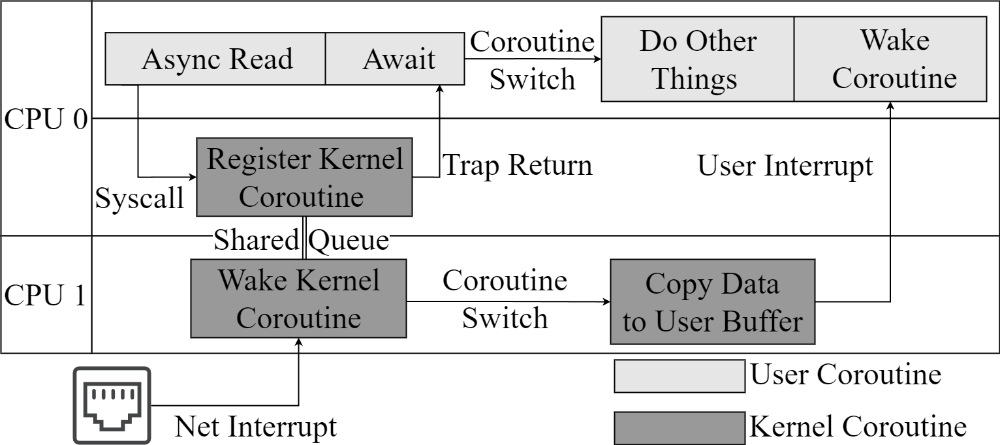

# Abstract

As a classical concurrency model, multi-threading technology has been widely supported by numerous operating systems and extensively applied in various application programs. However, as concurrency increases, the high system overhead and context-switching costs of multi-threading model have gradually become unacceptable. As a result, coroutines have emerged, but they often only have been supported by user-level  and are not recognized by the operating system, which led to the inability of the kernel to  estimate the workload of coroutine tasks in the system accurately to perform more precise scheduling strategy to achieve higher system resource utilization. Based on the above situation, we have carried out the following work: 1) We have designed a coroutine control block that allows both the kernel and applications to be aware of the coroutine's state, serving as the fundamental unit for kernel scheduling.2) We have introduced the concept of priorities within coroutines and designed a unified set of priority-based scheduling algorithms for both user-level and kernel-level coordination. 3) Finally, we analyzed the characteristics of the priority-based coroutine scheduling algorithms on QEMU and FPGA platforms, concluding that the coroutine scheduling algorithms has advantages in terms of switch overhead and granularity of resource utilization control.

# 1. Introduction

In the early days, operating systems introduced the abstraction of processes to meet the concurrency and isolation requirements of multiprogramming. However, due to the large resource granularity of processes and the high cost of inter-process communication, operating systems proposed the abstraction of threads as the basic scheduling unit. Threads share the same address space, enabling efficient communication among them. With the rapid increase in concurrency, the use of threads as concurrency units has gradually become unacceptable in terms of resource utilization. As of 2022, Google's servers are [handling 893 billion requests per day](./bibtex_ref/google10search), with an average of 8 million requests per second, posing a great challenge for both hardware and software. Handling such a large number of asynchronous requests cannot be supported solely by threads. In addition, as resource-constrained embedded devices become [increasingly commonplace in various fields](./bibtex_ref/mahbub2020iot) such as agriculture, education, and healthcare, the abstraction of threads still appears somewhat bloated in such devices. In scenarios with high concurrency or resource constraints, the industry has provided some solutions in both operating systems and programming languages. 

Linux provided system calls such as [select and epoll](./bibtex_ref/epoll) to support user-level asynchronous I/O tasks by multiplexing multiple I/O operations on a single thread. The epoll operation uses a single thread to poll multiple listening ports, and when no event occurs, the polling operation will cause the polling thread to be block until an event arrives and wakes it up.  When an event occurs, the polling thread will copy the corresponding listening port from kernel space and send it to a separate thread for event processing. Windows [I/O Completion Ports (IOCP)](./bibtex_ref/IOCP) also provide a similar mechanism for I/O multiplexing. Unlike Linux, Windows IOCP calls the callback function in the completion thread for post-processing work after the completion of an I/O operation, making it a truly asynchronous I/O operation. Although I/O multiplexing technology can effectively reduce thread resource waste, from the kernel's perspective, the poll thread is just an ordinary thread participating in regular scheduling, and the kernel cannot perceive the asynchronous tasks aggregated in the poll thread. Furthermore, I/O multiplexing forces user-level applications to adopt the producer-consumer model for handling asynchronous tasks, reducing the flexibility of user-level operations. [Native AIO](./bibtex_ref/nativeAIO) is a set of asynchronous I/O interfaces supported by the kernel, which avoids frequent switching and data copying between user space and the kernel. However, because it requires kernel support, it can only be used on specific operating system architectures and has poor compatibility. IO_uring is a relatively recent technology that adopts an innovative asynchronous method, allowing for the direct submission of IO requests in user mode, thus eliminating the need for context switches between user and kernel spaces. Additionally, it utilizes shared memory between user and kernel modes to prevent memory copying, thereby enhancing IO processing efficiency and throughput. However, excessive design has led to an increase in kernel complexity and a greater difficulty in utilizing the interface.

Moreover, compilers and runtime libraries have built a set of independent scheduling systems in user space based on the asynchronous support provided by the operating system. [Stackful coroutine such as goroutine , is an independent asynchronous runtime environment built on top of an operating system, which has lower context switching overhead than kernel threads and less invasive impact on the code](./bibtex_ref/revisitingcoroutine). However, the fixed stack size allocation in stackful coroutines may lead to the wastage of stack memory. [Stackless coroutines utilize state machines, which are usually automatically generated by the compiler, to share the function stack with the caller, further reducing the overhead of coroutines](./bibtex_ref/survey). Additionally, the language-based stackless coroutine mechanism is highly developer-friendly, minimizing the potential for programming errors as much as possible. [POSIX AIO](./bibtex_ref/posix-aio) is a set of asynchronous I/O interfaces implemented in user space through the POSIX thread interface, which is compatible with different architectures and operating systems that support the POSIX standard. Since the kernel is not aware of asynchronous tasks, there are significant overheads, including thread creation, scheduling, destruction, I/O buffer copying, and context switching cross domain. There has been considerable work on coroutines and asynchronous runtimes in user mode. However, these implementations are built on top of the kernel, making it difficult for the kernel to perceive coroutines in user mode, consequently preventing the kernel from performing fine-grained resource scheduling.

In addition to capturing execution errors in applications, the kernel also needs to handle high-privileged instructions such as device I/O operations. These events are not immediately triggered, thus the kernel also requires a lightweight asynchronous task scheduling mechanism for performance optimization. [LXDs](./bibtex_ref/LXDs) has developed a lightweight asynchronous runtime environment in the kernel for cross-domain batch processing. This runtime environment allows lightweight processes to be created in the kernel that can execute tasks asynchronously, thereby improving system throughput and responsiveness. [Memif](./bibtex_ref/memif) is an operating system service for memory movement that provides a low-latency and low-overhead interface based on asynchronous and hardware-accelerated implementations. [Lee et al.](lee2019asynchronous,.md) significantly improved application performance by reducing I/O latency through the introduction of an asynchronous I/O stack (AIOS) for the kernel. [PM-AIO](./bibtex_ref/Pm-aio) indicates that the Native AIO path appears as a pseudo-asynchronous IO in the PM file system, and true asynchronous AIO is achieved by splitting IO requests into different sub-files. These approaches often propose an asynchronous task scheduling scheme that is independent of the kernel thread scheduler, which lacks generality and scalability and increases the complexity of the kernel.


Based on the aforementioned discussion, we can summarize the following issues in the current state of asynchronous task scheduling in the industry:
1. The kernel provides fundamental abstractions such as processes and threads, but these can be overly cumbersome for scenarios involving high concurrency and limited resources.
2. Lightweight runtimes provided in user mode, such as stackless coroutines, cannot be directly perceived and scheduled by the kernel, leading to the kernel's inability to precisely control resource allocation.
3. Some asynchronous tasks within the kernel itself (such as cross-domain communication in LXDs) are built as separate runtimes within the kernel, lacking a unified scheduling framework.
4. Both user mode and kernel mode have requirements for asynchronous task scheduling and share similar scheduling characteristics, yet there is no reusable scheduling framework that can accommodate both.


# 2. Relative Work

This section will provide a brief introduction to some of the existing technologies and methodologies used in this paper.

#### Async Support In Rust

In its early stages, Rust supported stackful coroutines. However, to better address issues related to memory leaks and debugging, Rust discontinued support for [stackful coroutines in version 1.0 and instead adopted an asynchronous programming model based on async/await](./bibtex_ref/rust-async). Starting in 2018, Rust began supporting stackless coroutines in its nightly version. In this article, all references to coroutines refer to stackless coroutines.

The Rust compiler has the capability to transform asynchronous functions into coroutines. By using the async/await syntax, the compiler can expand an asynchronous function into a state machine that suspends when the asynchronous operation is not complete and resumes when it is completed. This transformation is performed at compile time, ensuring both efficiency and safety at runtime.

It is worth to note that Rust compiler does not provide an asynchronous runtime, but only provides abstractions such as Future for task management, Waker for asynchronous wakeups, and async/await syntax for transforming functions into state machines. Third-party libraries often leverage these abstractions provided by Rust to implement their own asynchronous runtimes.


The Rust asynchronous programming model is illustrated in Figure 1.2. First, the user creates a task and adds it to the global task queue. Then, worker threads in the Executor continuously fetch tasks from the task queue and execute them, creating a waker to maintain the task's execution status. When a task needs to wait for an asynchronous event, the waker is placed in the corresponding Reactor for the message and the worker thread executes other tasks. When the asynchronous event arrives in the Reactor, it finds the corresponding waker and uses the wake operation to re-add the corresponding blocking task to the task queue.

#### User-Space Interrupt Support

In traditional operating systems, signals are often transmitted between processes through the kernel. The sending process needs to enter kernel mode to attach the signal to the receiving process, and the performance overhead caused by the privilege level switch can lead to low efficiency. The receiving process often needs to wait until the next scheduling to respond to the signal, which means that the signal cannot be responded to in a timely manner, resulting in high latency. The emergence of user-space interrupt technology has made efficient signal transmission possible.

The term "interrupt" has traditionally been used to describe signals that originate from hardware and are processed in the kernel. Even the software interrupts we commonly use (i.e., signals generated by software) are also processed in the kernel. However, in recent years, a design has emerged that allows tasks in user space to send interrupt signals to each other without going through the kernel, and to process them in user space directly. In 2020, Intel introduced the [x86 user-space interrupt feature](./bibtex_ref/intel-white-paper) in the Sapphire Rapids processor, and in 2021, Linux submitted code for user-space interrupt support in an [RFC patch](./bibtex_ref/uint). Taking user-space signal transmission as an example, we analyze the advantages of user-space interrupts.

In traditional multi-core systems, when user processes running on two cores simultaneously communicate through signals, the sending process needs to enter the kernel to insert the signal into the signal queue of the receiving process, and wait for the receiving process to respond to the signal until it is next scheduled. However, in multi-core systems that support user-space interrupts, the sending process can directly send signals to the receiving process through a hardware interface, and the receiving process can respond immediately when scheduled on the core. In the best case scenario (i.e., when both the sender and receiver are both running on different cores), signal transmission in user-space interrupts does not require entering the kernel, and the receiving end can respond immediately.

# 3. Design

As described in section 1, the coroutine scheduling mechanism is typically used in level  and cannot be managed at the system level. The user-level coroutine scheduling mechanism can maximize its advantages only if combined with the asynchronous IO mechanism provided by the kernel. In addition, the kernel often needs to handle asynchronous tasks such as device reading and writing. From these aspects, we can conclude that the kernel suffers from the lack of a lightweight asynchronous task scheduling scheme.

Based on the existing conditions, we try to solve the above problems. We introduce coroutines into the kernel and use coroutines to complete kernel tasks, which includes asynchronous read and write tasks. As for the scheduling scheme of kernel coroutine and user level coroutine, we design a set of coroutine scheduling scheme across kernel and user processes --- shared-scheduler. We use coroutines to reduce the overhead of threads in traditional asynchronous schemes, and coordinate the scheduling between kernel and user processes by shard-scheduler. The whole scheduling system has the following characteristics: 

- Unification: with the introduction of coroutines into kernel, asynchronous IO mechanisms that previously required independent kernel threads to support can now be implemented with lightweight coroutines, where all tasks in kernel exist as coroutines, and user-level tasks also exist as coroutines. In this case, the behavior of  kernel and user processes is highly unified.
- Sharing: once the coroutine is introduced, the runtime is essential. if the API is provided in the form of a static library, then each process and kernel will have a copy of the runtime code, resulting in unnecessary memory waste. Therefore, we use the vDSO mechanism to share the runtime in the kernel with all user processes. In addition, we define a priority scheduling mechanism to manage the priority of all processes and coroutines in kernel in the form of shared memory.
- Compatibility: although the coroutine is the basic task unit, the system still retains the thread-related system call interface, which does not affect the original system call and is compatible with the original user program.

## 3.1 System Architecture

<div>
    <center>
    
    <br>		<!--换行-->
    Figure 2, system architectture. The solid brown line indicates the scheduling that occurs in the system, while the dashed brown line means that the cpu's execution changes.	<!--标题-->
    </center>
</div>

The system architecture is shown in figure 2. We propose to use an Executor data structure with a priority bitmap to manage coroutines. The Executor maintains multiple priority coroutine queues, which exist in their own address Spaces and can only be maintained by shared-scheduler, which is represented by ① and ③ in figure 2. The kernel shares the shared-scheduler with all user processes in the way of a vDSO. Once the kernel and user processes are initialized, they execute the shared-scheduler, fetch the highest priority coroutine from their respective Executors to execute, and update the priority bitmap.

## 3.2 Priority Mechanism

To support the priority mechanism, we must extend Rust's coroutine structure. In Rust, the original coroutine structure is a closure that implements the Future feature. On this basis, we extend coroutines structure by adding ID field for identification and priority field for scheduling order, which we call the whole structure coroutine control block.

First, we maintain a local priority bitmap in Executor as well as several queues of different priorities, where the coroutine ids of the corresponding priorities are stored. One of bit in the bitmaps corresponds to whether a ready coroutine exists in a priority queue. The bitmap in Executor will be modified when creating, scheduling and deleting coroutines. When scheduling, the shared-scheduler scans the queue according to the local priority bitmap in the Executor and selects the ready coroutine with the highest priority to execute, thus completing the coroutine scheduling within the process or kernel.

However, the order of execution between user processes and kernel needs to be described by a global bitmap. Because all tasks of user processes and kernel exist in the form of coroutines, it is natural to think of using the highest priority of all coroutines within the process to express the priority of the owning process, but this has brought trouble to maintain the global bitmap. For security, the system can scan the local priority bitmap of all processes to matain the global bitmap while entering kernel, but it is very expensive. In contrast, using shared memory is undoubtedly the fastest way, but it is not secure. We made a trade-off between these two approachs, and finally chose the shared memory approach.

## 3.3 Processes, Threads and Coroutines

After introducing coroutines, we sort out the relationship between process, thread and coroutine. There is no doubt that the coroutine is the task scheduling unit, and the concept of process and thread has a certain change. First of all, if the kernel is treated as a special process, coupled with the two-page-table mechanism, both falling into kernel and returning to user state need to switch the address space, so the process's role is very clear, it is responsible for managing the address space.

The responsibilities of thread change greatly, and usually it is not bound to a specific task, but only loops through the scheduling code of the shared-scheduler, in which case multiple threads are created so that the same process can allocate more CPU resources. Threads are tied to specific tasks only when needed, so the thread's responsibility is to provide a running stack.

After defining the relationship between them, there are still certain issues that need to be resolved. With the description of priorities in Section 3.2, the scheduling sequence for intra-process coroutines, process, and kernel is clear, but we have not yet addressed the issue of switching. The switching of coroutines can be done with the help of the compiler, while the switching of processes and threads seems to be incompatible in the new system. To solve this problem, we defined a special coroutine in the kernel --- the switching coroutine (SC), which, as the name suggests, is used to switch between the kernel and the process. Usually switching code does not have any meaning, and this helped us clarify the definition of this code. It will select the process with the highest priority according to the global priority bitmap, and switch to a thread inside the process to enter the user mode.

Aside from the scheduling and switching issues, the really hard issue is how to build a state transition model that makes the new system compatible with threads. Although most of the time the thread is not bound to a specific task, there are still some special cases where a coroutine has not completed execution, when the thread will be bound to the coroutine. Therefore, this special case should be considered when establishing state transition model. Finally, we built the state transition model shown in figure 3.

<div>
    <center>
    
    <br>		<!--换行-->
    Figure 3, state transition model. The solid red lines represent state transitions between threads and interactions between threads and its internal coroutines.	The solid gray lines represent coroutine state transition in thread.<!--标题-->
    </center>
</div>

### 3.3.1 Independent state transitions

The coroutine has five states: create, ready, running, blocked and exit. This state model is similar to the five-state model for threads. Once a coroutine is created, it becomes ready and is going to turns to running state by scheduling. At running time, the current coroutine may become blocked because of waiting for an event, or it may yield due to another coroutine which has higher priority, or it may exit after completed its execution. When the coroutine is blocked, it can only wait for an event to wake up itself to become ready state. Similarly, the state transition model for threads is similar.

### 3.3.2 Interactional state transitions

The thread and coroutine respectively independent state transitions mentioned above is very clear. Hoever, the state transitions which is caused by the interaction between them are quite obscure. Fortunately, we can easily conclude thay when a thread is ready or blocked, the state of its inner coroutines does not change util the thread is running, shown in figure 3.

In addition to above obvious conclusion, we can analyze from the type of event that causes the thread state change. Overall, these events are still scheduling, yield, waiting and waking up, but we can divide them into fine-grained categories.

- **External events unrelated to inner coroutines**: for example, no matter what state the inner coroutine is in, thread will be preempted into a ready state due to a clock interrupt.
- **External events related to inner coroutines**: the event that the thread inner coroutine is waiting has arrived, the waiting coroutine need to be rescheduled, which will result in the thread turn to ready state from blocked state.
- **Inner coroutine state change**: in this case, the first event that causes thread state changing is the coroutine actively yield. When a coroutine turned to ready or blocked state, and the next coroutine needs to be scheduled, however, if another coroutine with higher priority in other processes is detected at the same time, the thread will be yield to become ready state. Besides, once an exception occurs while a coroutine is running, the thread must be blocked waiting for kernel to handle the exception.

In addition to the conceptual and model changes, in the implementation, we did not make any changes to the semantics of thread-related system calls, the new system can not only take advantage of coroutines, but also be compatible with multi-thread model without additional overhead.

# 4. Implementation

After defining the overall architecture of the new system and solving the related problems, we defined an asynchronous software ecosystem. Firstly, we provide APIs for both kernel and user processes. Secondly, we make some adaptation to provide a Completely asynchronous environment. Finally, we make an asynchronous transformation to the IO system call. This section will cover the implementation details in the asynchronous software ecosystem.

### 4.1 Programming APIs

We provide the following APIs to achieve more programming convenience.

| Function | Description                                  |
| -------- | -------------------------------------------- |
| spawn    | Create a new coroutine.                      |
| get_cid  | Get the current coroutine id.                |
| wake     | Wake up a specific coroutine.                |
| reprio   | Adjust the priority of a specific coroutine. |

As mentioned in section 3, we used the vDSO mechanism, once a user program uses an interface in the table, the kernel links its symbols while the process is created.

### 4.2 Completely asynchronous scheduling environment

To achieve better uniformity in coroutine scheduling, we have carried out compatibility adaptations on the previously Unix-like runtime environments in both user processes and kernel. We have provided a completely asynchronous scheduling environment for both user processes and kernel.

For user processes, it will be initialized using the shared-scheduler environment initialization function. After initialization, the main function of the user program will be encapsulated into an asynchronous coroutine (which is equivalent to a synchronous task that cannot be awaited) and added to the ready queue for unified scheduling. In the end, all tasks in the user process are executed under the scheduling of the shared-scheduler.

For kernel, the original scheduling task used to schedule user processes is also encapsulated as a kernel scheduling coroutine, which participates in scheduling along with other ordinary kernel coroutines. Since the scheduling of user processes is synchronous, it is necessary to manually block and switch to other kernel coroutines.

### 4.3 Asynchronous IO system calls

Synchronous IO system calls, such as "read", will block the entire thread. In a fully asynchronous coroutine programming environment, it is necessary to transform system calls into asynchronous operations to ensure that they only block the current coroutine at most. The support for asynchronous IO system calls mainly involves two parts: user space and kernel space.

#### 4.3.1 User Space Modification

The modification of the user space system call interface to support asynchronous calls needs to consider both functional differences and formal consistency. There should be an effort to minimize the differences from synchronous system calls. Additionally, automation should be considered throughout the modification.

To enable system calls to support asynchronous features, an `AsyncCall` auxiliary data structure needs to be added, which shoule implement the Future trait. After completing this work, the `await` keyword can be used when calling the asynchronous system calls.

The formal differences should be minimized as much as possible. We use Rust language procedural macros to generate both synchronous and asynchronous system calls. Finally, synchronous and asynchronous system calls achieve a high degree of consistency in the form, with the only difference being the parameters. The format is shown in the table below.

```rust
#[async_fn(true)] 
pub fn read(fd: usize, buffer: &mut [u8], key: usize, cid: usize) -> isize {
	sys_read(fd, buffer.as_mut_ptr() as usize, buffer.len(), key, cid) 
}

#[async_fn]
pub fn write(fd: usize, buffer: &[u8], key: usize, cid: usize) -> isize { 
	sys_write(fd, buffer.as_ptr() as usize, buffer.len(), key, cid) 
}

read!(fd, buffer, key, current_cid); // async call
read!(fd, buffer); // sync call
```

#### 4.3.2 Kernel Space Modification

In addition to ensuring formal consistency in the user-level system call interface, we also aim for consistency in the kernel system call processing interface. Ultimately, the kernel determines whether to execute synchronous or asynchronous processing logic based on the system call parameters. In the case of asynchronous processing, the kernel uses some method to immediately return the task to user space without waiting for the corresponding processing flow to complete synchronously. Once the kernel completes the corresponding asynchronous processing, it wakes up the corresponding user-level coroutine.

For instance, the following diagram illustrates the entire workflow of an asynchronous system call for socket read operation. After entering the kernel, the operations that were originally done synchronously by kernel will be encapsulated into a kernel coroutine, which is then added to the kernel Executor. Then it immediately returns to user space and generates a future to wait for the waking up of the user coroutine that executes the asynchronous system call. At this time, the shared-scheduler will switches to execute the next user coroutine. After the asynchronous system call returns to user space, the kernel coroutine which encapsulates related operations is not executed. The kernel coroutine waits for the network driver to notify the kernel after the data is ready, and then the kernel coroutine is awakened to execute the corresponding operations. Once the kernel finishes the workflow (in this case, copying data to the user space buffer), it generates a user space interrupt, passing the ID of the corresponding user coroutine to be awakened. The user space interrupt handler then wakes up the corresponding coroutine.




# 5. Performance Evaluation

To demonstrate the lower switching overhead of coroutine programming model compared to thread programming model, we constructed two different TcpServer models using coroutine and thread respectively to test the server's throughput, message latency, and latency jitter.

In addition, we will demonstrate the significant role of priority in ensuring the real-time performance of certain specific tasks under limited resources by analyzing the impact of coroutine priority on task throughput, message latency, and latency jitter in the TcpServer experiment.

We implemented the shared-scheduler based on rCore, which is a small operating system almost entirely written in Rust, characterized by its compactness and efficiency. It can also fully leverage Rust's support for asynchronous programming to quickly implement the shared-scheduler.

The Msg Sender in the client periodically sends a certain length of data to the server, while the Msg Recv in the client receives the server's response, calculates the response latency, and waits for the timer to expire before sending the next request. Each connection in the server consists of three components:

- **Msg Recv**, which receives requests from the client and stores them in the request queue.
- **Msg Server**, which takes messages from the request message queue, performs matrix operations, and sends the results to the response message queue.
- **Msg Sender**, which takes responses from the response message queue and send them to the client.

These three components transfer data through the shared message buffers.

## 5.1 Coroutine programming model vs. thread programming model

To evaluate the advantages and disadvantages of the coroutine and thread programming models, as well as the switching overhead between them, we implemented the three components of the Server Process using the thread model and the coroutine model respectively. We represent the test results for processing 1 × 1 matrix requests in the thread model as Thread-1, and the test results for processing 20 × 20 matrix requests in the coroutine model as Coroutine-20. Similarly, the other results are represented accordingly. The experiments were conducted on 4 physical CPUs, with the server allocating 4 virtual CPUs. The timeout period set by the client's timer is 100ms.

The test results for message latency are shown in the following figure. As can be seen from the figure, the thread model has similar or even slightly lower message latency than the coroutine model when the number of connections is small. This is because when the number of connections is small, the kernel can directly schedule threads to execute tasks, while the coroutine model adds an extra layer of synchronization and mutual exclusion operations in the scheduler, resulting in slightly higher latency. As the number of connections increases, the delay of the thread model rapidly increases and is much higher than that of the coroutine model. This is because most coroutine switches do not need to trap into the kernel, only switching the function stack, resulting in much smaller switching overhead than threads. Comparing different matrix request sizes under the same model, it is found that the larger the matrix size, the higher the latency, which is due to the larger overhead of message sending and receiving and message processing for larger matrix requests, leading to an expected increase in latency.


The figure also shows the test results of the total throughput for different matrix request sizes under different models. It can be seen that the total throughput of the server under the coroutine model increases linearly with the increase of the number of connections, even when the matrix request size increases. Since the load has not reached the peak (the client sends a request every 100ms, and the highest latency shown in the figure is only 10ms), the throughput depends on the number of connections and the client's request frequency. For the server under the thread model, it can keep up with the coroutine model when the number of connections is small, but as the number of connections increases, the switching overhead increases rapidly, leading to a slowing down of the total throughput increase trend. As for Thread-20, the load almost reaches its peak when the number of connections is around 64.

## 5.2 Priority-controlled resource allocation

In computer systems, both CPU and IO resources are always limited. Under such resource constraints, we can prioritize certain services by setting their priority levels. In the context of a TcpServer, we can set the priority levels of each connection in a hierarchical manner to ensure lower latency and reduced latency jitter for certain connections.

Our experiments were conducted on four physical CPUs. The clients sent request messages with a matrix size of 20x20 at a period of 50ms. The server was implemented using coroutines. We established 128 connections between the clients and server, divided equally among 8 priority levels, and tested the performance of the connections with different priority levels under different numbers of virtual CPU.

The test results are shown in the figure below, where "x-core" in the legend represents the number of virtual CPU cores allocated to the server. The results indicate that under resource constraints, only connections with higher priority levels (lower priority numbers) are able to achieve higher throughput and lower request latency. With the increase in resource quantity, the system is able to ensure that connections with lower priority levels also achieve higher throughput and lower latency, while still adhering to the requirement that the highest priority level has the highest throughput and lowest latency. Furthermore, we also observed that with the increase in virtual cores, there was a slight performance degradation for high-priority connections. This is due to the increased synchronization and mutual exclusion among poll threads in the scheduler caused by the increase in virtual cores. In the future, this issue can be alleviated by introducing multi-level ready queues.


We further analyzed the distribution of message latency for each priority level, as shown in the figure below. This largely conforms to the characteristics of prioritizing high-priority connections in request handling.


# 6. Conclusion

In this paper, we propose a general and user/kernel-space shared asynchronous scheduling framework called the shared scheduler. We introduce the concept of coroutine into the kernel as a scheduling unit, reducing context switching overhead and improving system resource utilization. And we have designed an $O(1)$ complexity priority scheduling algorithm based on the priority of each coroutine. Finally, we implement asynchronous system calls using user-space interrupts to reduce the overhead of kernel-space context switching. In the scenario of TcpServer, the server implemented by the shared scheduler exhibits lower context switching overhead and higher resource utilization.

