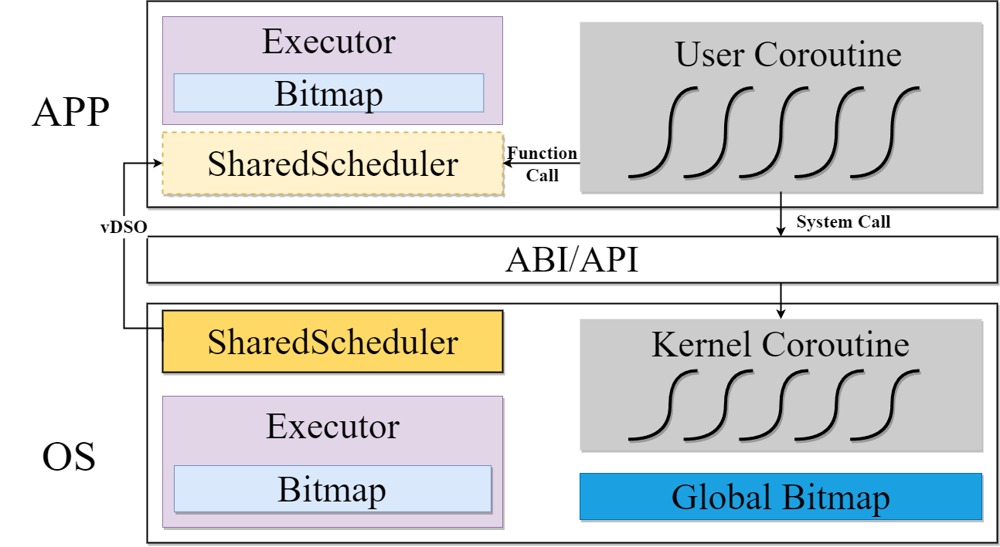
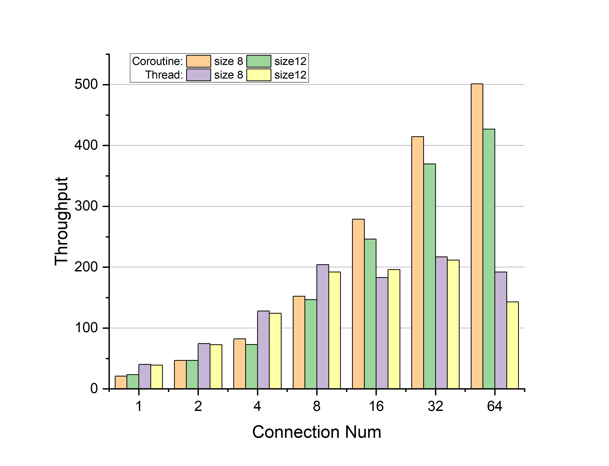
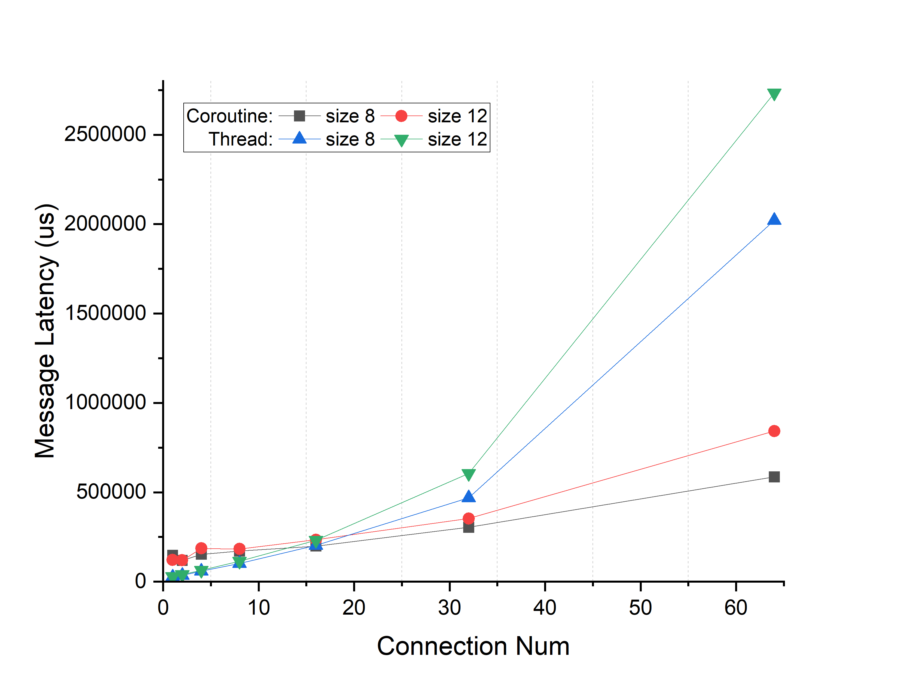
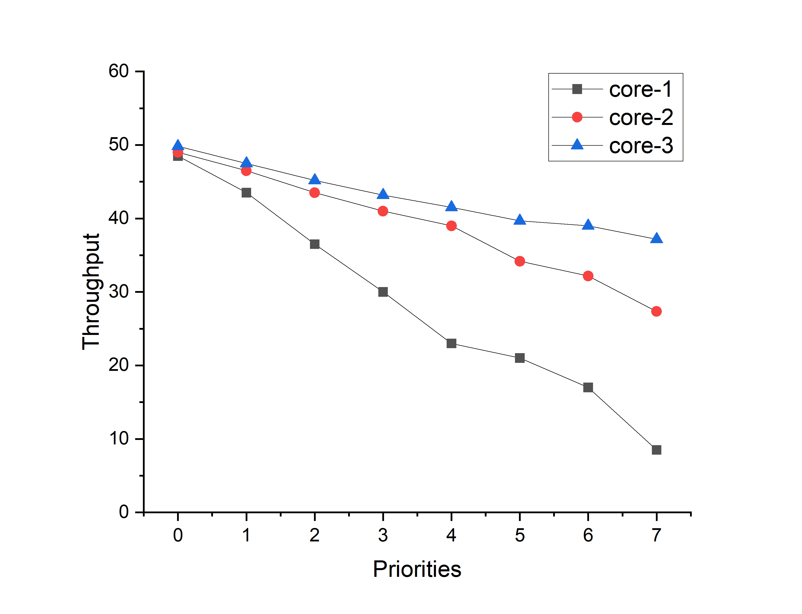
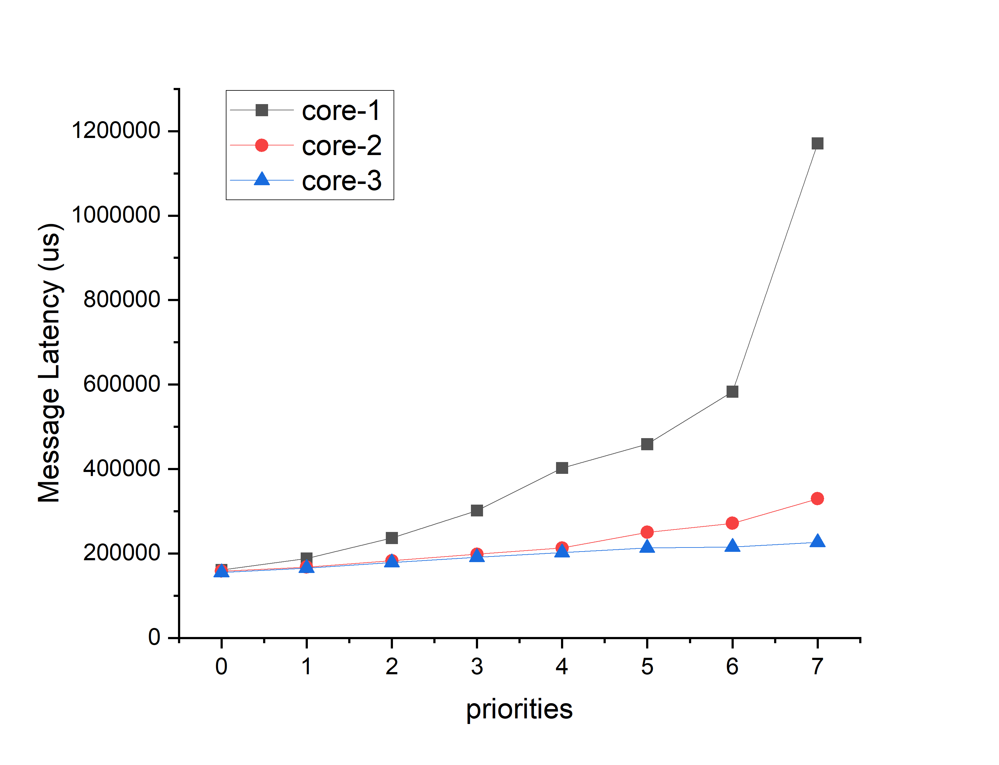
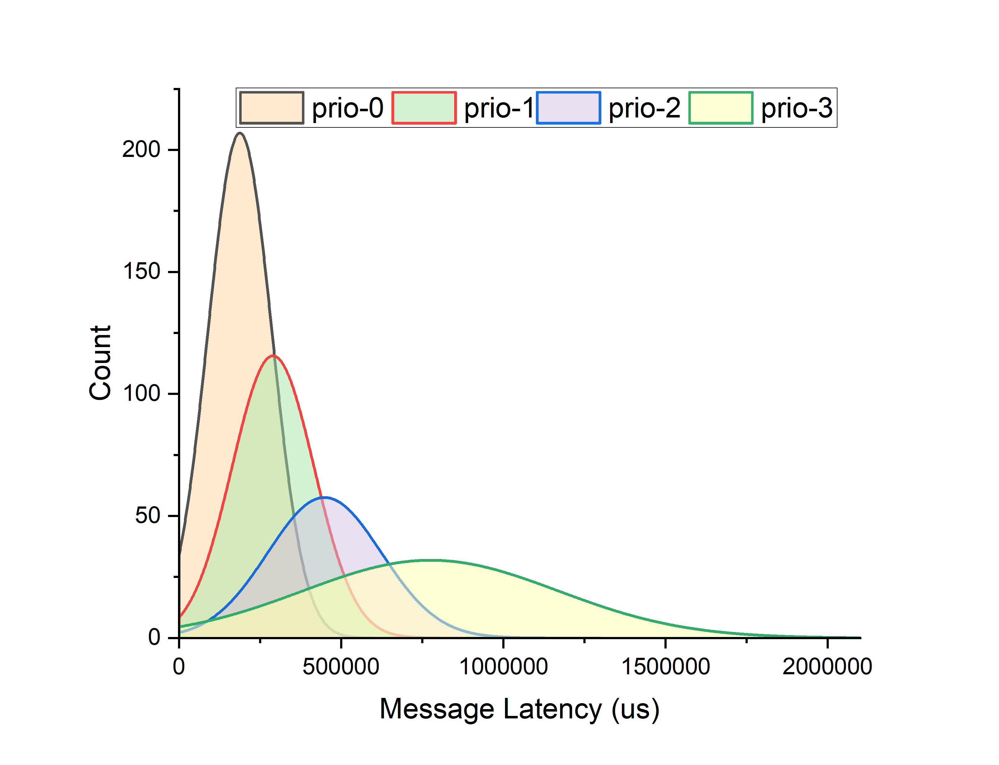
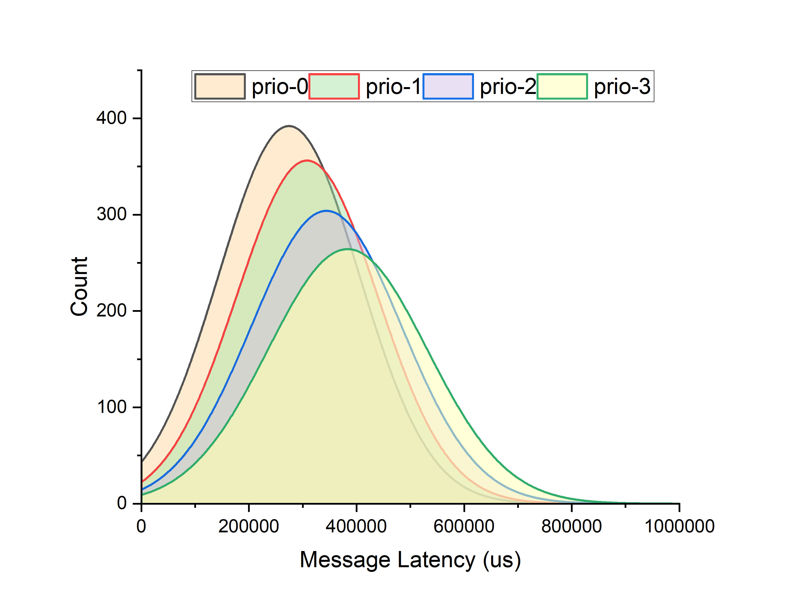

### SharedScheduler：操作系统感知的基于协程的调度框架

#### Abstract

多线程技术作为一种经典的并发模型，得到了众多操作系统的广泛支持，并广泛应用于各种应用程序中。然而，随着并发性的增加，多线程模型的高系统开销和上下文切换成本逐渐变得不可接受。因此，出现了用户级线程，但它们往往只得到用户态的支持，而不被内核态所感知，这导致内核无法准确估计系统中协程任务的工作量，从而执行更精确的调度策略，以达到更高的系统资源利用率。基于上述情况，本文提出 SharedScheduler，一种能够被操作系统内核感知的协程调度框架。它具有以下特点：1）将协程引入到内核和应用程序中，作为最小的任务单元，用于替换传统的多线程并发模型。2）通过给协程附着上优先级，SharedScheduler 能够利用优先级位图机制实现对协程的调度，并且让操作系统内核能够在一定程度上感知用户态协程，从而使得内核与用户进程协调统一调度。3）将内核协程与异步 I/O 机制结合起来，为操作系统中的异步任务提供协调统一的调度框架，统一了异步操作的行为。最终，我们构建出一个常见的 web server 应用场景，在 FPGA 平台上对 SharedScheduler 进行了测试，在高并发的场景下，使用协程能够显著减少多线程并发模型带来的切换开销，使得吞吐量提升 1.05 ~ 3.93x，并且能够利用优先级实现对协程的精准控制，使得在资源有限的情况下，高优先级协程依然能够得到保障。


#### 1. Introduction

目前的 web server 具有不断增强并发性、可扩展性的需求。大规模的 web server 必须容纳数以万计同时存在的客户端连接，并且不能产生明显的性能下降。截至2022年，谷歌服务器每天处理8830亿次请求，平均每秒处理800万次请求。针对如此大规模的并发请求数量，多线程模型程序取得了一定程度上的成功，但随着需求逐步扩大，多线程模型的不合适性逐渐暴露出来。

1）线程作为底层硬件的抽象，是非常不确定的（引用自 The Problem with Threads）。在多线程模型下，程序执行顺序的不确定性导致了共享资源的访问顺序不确定，尽管通过合理的应用同步互斥机制可以确保共享资源在并发环境下能够正确、安全的访问，但使用多线程并发程序无疑是依赖一种不确定的方式来获取确定性目标。而在 web server 这种并发场景下，需要做的是监听收到的请求包，进行处理并返回结果给客户端，这种确定性的资源访问顺序，盲目使用多线程模型是非常不合适的。

2）多线程模型很难使用异步 I/O，尽管可以与操作系统底层的事件驱动模型进行结合，但会增加操作系统的复杂性。例如，Linux提供了 [select and epoll](./bibtex_ref/epoll) 等系统调用，通过在单个线程上复用多个I/O操作来支持用户级异步I/O任务。epoll 将多线程模型与事件驱动相结合，但仍需要操作单个线程来轮询多个侦听端口，当没有事件发生时，轮询操作将导致轮询线程被阻塞，直到事件到达并唤醒它。当事件发生时，轮询线程将从内核空间复制相应的侦听端口，并将其发送给单独的线程进行事件处理，这种做法需要通过生产者-消费者模型进行交互，增加同步互斥的开销。Windows 的 [I/O Completion Ports (IOCP)](./bibtex_ref/IOCP) 也提供了类似的I/O多路复用机制，但它更加接近事件驱动模型，在完成I/O操作后调用线程中的回调函数进行后处理工作，使其成为真正的异步 I/O 操作，但这种异步回调的方式具有非常高的开发难度。而 io_uring 则采用了一种创新的异步方法，允许在用户模式下直接提交 IO 请求，从而消除了在用户和内核空间之间切换上下文的需要。此外，它利用用户模式和内核模式之间的共享内存来避免内存复制，从而提高IO处理效率和吞吐量。然而，过度的设计导致了内核复杂性的增加和使用接口的更大困难。除此之外，还有通过 POSIX 线程接口直接在用户空间实现的异步 I/O 接口 [POSIX AIO](./bibtex_ref/ POSIX - AIO)，它兼容支持 POSIX 标准的不同架构和操作系统。但由于操作系统不知道异步任务，因此有很大的开销，包括线程创建、调度、销毁、I/O缓冲区复制和跨域上下文切换。

3）线程需要占用的资源较多，内核支持的线程需要一套完整的硬件线程抽象（堆栈、通用寄存器、程序计数器等），因此不仅占用的资源较多，且其切换开销较大，在大规模并发时，会带来严重的性能下降。尽管用户态线程能够减少切换开销，增强灵活性，例如 goroutine，但通常是将多个用户态线程映射到一个内核线程上，因此操作系统很难感知用户态线程，不能执行细粒度的资源调度，内核不会因为一个内核线程上映射了大量的用户线程而为其分配更多的资源。

在针对多线程模型不适用于大规模并发的 web server 场景的问题，已经展开了很多研究工作，但大部分仍然选择继续使用线程这个不轻量的抽象，没有从根本上解决问题（引用：Combining Events And Threads For Scalable Network Services Implementation And Evaluation Of Monadic, Application-level Concurrency Primitives，Cooperative Task Management without Manual Stack Management，致力于将多线程模型与事件驱动模型结合起来）。除了上述问题，在大规模并发的 web server 程序中还需要异步 I/O 机制的支持，这给操作系统带来了严峻的挑战。操作系统不仅需要给应用程序提供异步 I/O 支持，还需要给自身的一些异步任务构建出一套运行时。尽管已经有相关的研究展开，例如，[LXDs](./bibtex_ref/LXDs) 在内核中开发了一个轻量级的异步运行时环境，用于跨域批处理。这个运行时环境允许在内核中创建轻量级协作线程，这些线程可以异步执行任务，从而提高系统吞吐量；[Memif](./bibtex_ref/ Memif) 是一个用于内存移动的操作系统服务，它提供了一个基于异步和硬件加速实现的低延迟和低开销接口；[Lee等人]((lee2019asynchronous,.md))通过为内核引入异步 I/O 堆栈（AIOS）来减少 I/O 延迟，从而显著提高了应用程序性能；但这些方法通常独立于内核线程调度器之外，导致缺乏通用性和可扩展，并且增加了操作系统内核的复杂性。

针对上述多线程模型存在的问题，在本文中，我们提出了 SharedScheduler，一种操作系统内核感知的基于协程的调度框架。SharedScheduler 使用协程作为基本的任务单元来解决多线程模型切换开销大、访问共享资源顺序不确定的问题。并且，SharedScheduler 借鉴了已有的针对异步 I/O 机制的研究，将协程引入到操作系统内核内，与异步 I/O 机制相结合，为操作系统中的所有异步任务提供协调统一的调度框架，统一了异步操作的行为。


#### 2. Background And Motivation

近年来，协程引起了广泛的关注，例如 DepFast 在分布式仲裁系统中使用协程；Capriccio 使用相互协作的用户态线程来实现可扩展的大规模 web server。根据前人的研究，我们认为协程在构建大规模并发程序的场景下是大有作为的。

##### Coroutine

协程是一种轻量级的并发编程技术，支持在单个内核线程上协作调度多个执行流。与传统的内核线程或进程相比，协程具有更低的资源开销和更高的执行效率。现代的编程语言，如[c++ 20](./bibtex_ref/ pcp -coroutine)、[Go](./bibtex_ref/goroutine)、[Rust](./bibtex_ref/ Rust -async)、[Python](./bibtex_ref/ Python -coroutine)、[Kotlin](./bibtex_ref/ Kotlin -coroutine)等，都为协程提供了不同程度的支持，根据协程的实现方式，可以划分为以下两类：

1）Stackful：一类为 **有栈协程**，也称用户态线程，其中以 Go 语言提供的 [Goroutine](./bibtex_ref/ Goroutine) 为代表。Goroutine 是 Go 编程语言中的协程实现，它简化并增强了并发编程，允许在单个内核线程内进行大量并发执行。在 Go 语言中，使用 “Go” 关键字后跟一个函数调用来创建 Goroutine。此函数调用与同一地址空间中的其他 Goroutine 并发运行。Goroutine 有自己的运行栈空间，由 Go 语言内集成的运行时动态分配和管理，这个栈空间能够用于保存局部变量和函数调用关系。因此，这类用户态线程相比于内核线程，减少了寄存器切换时的开销，但效果有限。

2）Stackless：另一类则是以 Rust 语言为代表的无栈协程。Rust 语言支持的协程是通过 async/await 语法和相应的运行时库实现的。与用户态线程相比，Rust 协程是作为无栈的，它不需要预先分配固定大小的栈空间。相反，协程的栈空间是根据需求进行动态分配和释放的。这使得协程的创建和销毁非常轻巧和高效。

综合上述分析，我们选择了使用无栈协程来替换传统的多线程模型，将其应用在大规模并发的 web server 场景中，并且由于 Rust 语言编译器的严格检查机制以及内存安全方面的显著优势，我们选择了 Rust 协程。随着对 Rust 协程的进一步了解，我们逐渐认识到协程与异步 I/O 机制之间的紧密关系（引用 tokio），并且 Rust 提供的高级抽象使得系统开发人员能够灵活的定义协程，我们可以在内核中引入与用户态协程一一对应的内核协程，用于处理各种各样的异步任务，从而消除内核底层事件驱动的必要性。这给在操作系统中定义一套统一的异步任务调度机制提供了契机。

##### Motivation

我们针对大规模并发的 web server 场景下的研究，以及学术界和工业界对协程的关注促使我们开始重新思考并发模型和异步框架，寻求能够满足更大规模、更高性能需求的解决方案。为此，我们提出了一个操作系统感知的基于协程的调度框架，让操作系统内核中的异步 I/O 任务与用户态协程的调度能够协调统一，提供一套统一的异步 I/O 框架，满足高并发的需求。


#### 3. Design

这一章节将介绍 SharedScheduler 协程调度框架。我们首先将介绍 SharedScheduler 中提供的与协程运行时相关的数据结构，来描述如何实现对协程的调度（Section 3.1）；紧接着，我们将介绍在操作系统内核中引入协程并与异步 I/O 机制结合后，将会产生的影响（Section 3.2）；最后，我们深入到 SharedScheduler 的系统框架和内部逻辑，描述它的实现（Section 3.3）。


##### 3.1 Coroutine Runtime

Rust 语言提供了两个高层次的抽象，***Future***和 ***Wake***，以支持协程机制，而不限制具体的运行时实现方式。因此，我们可以利用这个解耦属性来定制一个既可以在内核进程中也可以在用户进程中使用的协程运行时。协程运行时主要由以下两个部分组成：1）Coroutine Control Block；2）Executor。

###### 3.1.1 Coroutine Control Block

Rust 语言提供了 async/await 关键字，使得创建和执行协程非常容易，编译器将带有 async 关键字的函数编译成有限状态机，通过轮询推进协程执行，这一过程是透明的，因此我们不能准确的完成对协程的控制 。因此，我们在 Rust 语言提供的 Future 和 Waker 抽象的基础上，增加额外的字段组成协程控制块，从而实现对协程的精确控制。以下是协程控制块的结构：

```rust
pub struct Coroutine{
 /// Immutable fields
 pub cid: CoroutineId,
 pub kind: CoroutineKind,
 /// Mutable fields
 pub priority: usize,
 pub future: Pin<Box<dyn Future<Output=()> + 'static + Send + Sync>>, 
 pub waker: Arc<Waker>,
}
```

如何推动协程的执行以及如何切换和保存协程的上下文是最重要的问题。幸运的是，Rust 已经提供了两个相对完善的抽象，Future和 Wake。Future 抽象所需的 poll 函数用于推动协程执行，而 Wake 抽象与协程的保存和上下文切换密切相关。协程的执行和上下文切换都是由编译器来帮助我们完成的，并且是透明的。因此，必须在协程控制块中描述 future 和 wake。然而，仅靠这两个字段无法达到精确控制的目的，只能使用粗暴的轮询方式推动协程执行，无法与异步 I/O 机制结合起来，真正发挥出协程的优势。为此，我们在协程控制块中，使用三个额外的字段实现了对协程的精确控制。1）cid 用于标识协程控制块，并且在异步 I/O 机制中发挥关键性的作用；2）Kind 字段用于指示协程任务所属的类型，在推动协程执行到一定阶段后，SharedScheduler 将根据协程的任务类型进行不同的处理；3）Priority 字段表示任务的优先级顺序，作为 SharedScheduler 调度框架的基础。

注意到，我们并没有给协程标注状态字段，因为 Rust 协程只有 pending 或 ready 两种状态，因此，协程所处的状态由它所在的队列隐式的描述。

###### 3.1.2 Executor

Executor 是协程运行时的主要部分，它建立在 Coroutine Control Block 的基础上，负责管理进程内的所有协程。它的主要结构包括以下几个部分：

1）就绪队列与优先级位图：Executor 维护了多个不同优先级下的就绪队列，协程被存储在与其优先级相对应的队列中。这保证了具有最高优先级的协程每次都可以优先执行。此外，Executor 还需要维护与就绪队列对应的优先级位图结构，以指示相应的优先级下是否存在协程，尽管在用户态再额外维护这个结构是多余的，但这个结构是为操作系统内的调度而服务的，操作系统将通过这个数据结构从而获得一定程度上感知用户态协程的能力。

2）阻塞集合：所有执行后处于阻塞状态的协程将由这个结构统一进行管理，直到协程等待的事件出现，再从这个集合中唤醒。

这两个数据结构提供了协程的运行时环境，并且为 SharedScheduler 提供了基本的优先级调度机制，保证了 SharedScheduler 中的协程优先级调度在单个进程地址空间内能发挥作用，每次能够调度到优先级最高的协程。

##### 3.2 Concurrency

通过协程模型，应用程序能够在一个内核支持的线程上支持多任务并发。并且应用程序的多个任务之间可以通过相互协作的方式访问共享资源，而不是以多线程的形式进行无序的竞争，这种方式能够消除多线程模型对于共享资源访问的不确定性。然而，在 web server 数以万计的连接的场景下，单独依靠协程实现的并发是不足以应对如此巨大的需求。为此，SharedScheduler 向应用程序提供了创建内核支持的线程接口，但限制了使用方式，只能用于申请更多的 CPU 资源以应对大规模并发。

当应用程序申请更多的 CPU 时，由于所有的协程由 Executor 进行管理，调度必须通过 Executor 进行，因此我们通过互斥锁来保证正确访问 Executor 数据结构。尽管这里引入了不确定性，但 SharedScheduler 内部的同步互斥机制对其进行了处理，对应用程序完全透明。这种方式对应用程序的编程范式产生了一定影响，应用程序开发者不再需要考虑多线程并发时的同步互斥，只需要定义好协程任务以及协程之间访问共享资源的顺序，降低了开发负担。

##### 3.3 Combine coroutines with asynchronous I/O mechanisms

将协程与异步 I/O 机制进行结合是 SharedScheduler 的另一个创新点。我们在分析目前内核中的异步 I/O 机制时发现，多线程模型和事件驱动模型均存在一定的缺陷，而在内核中引入协程则恰好可以解决这两个问题，一方面解决了线程模型资源粒度过大的问题，另一方面，async/await 同步式的代码风格便于推理控制流的变化，避免“回调地狱”的发生，再结合 Executor 中的阻塞集合数据结构，我们可以定义一套统一的异步 I/O 框架。当异步任务阻塞时，对应的协程将会进入阻塞集合中等待事件发生，而事件发生后，原本事件驱动模型中的回调函数将被统一成一种行为，即从阻塞集合中唤醒对应的协程，从而能够复用 SharedScheduler 提供的协程优先级调度。

然而，将协程引入到操作系统内核中的异步 I/O 机制中替换原有的多线程模型，无疑给操作系统中进程以及线程这些基本概念等带来了新的变化。进程的职责非常明确，用于保证地址空间的隔离，在内核地址空间隔离 (KPTI) 的情形下，进入内核和返回用户进程都需要切换地址空间，此时内核也可以看作一个特殊的进程。至于线程，它的作用则被大大削弱，不再作为任务调度的基本单元，只是为协程提供一个运行栈，以及作为多处理器系统并行的抽象而存在。因此，在任务调度中不再需要传统的线程状态模型，取而代之的是协程状态模型。

与线程状态模型类似，协程具有五种基本状态：创建、就绪、运行、阻塞和退出，但还存在一种特殊的状态—运行挂起状态。这是由于操作系统提供的抢占式调度以及一些其他的特殊情况导致的。协程只在处于运行状态时才拥有栈，但处于运行状态的协程可能会被时钟中断、异常或者进入内核执行同步系统调用而打断执行过程，这种情况下，协程将在一定时间尺度上处于占有运行栈，但已经不处在 CPU 上执行的状态，因此我们将其定义为运行挂起状态，根据产生原因可将其进一步划分为运行中断状态和运行异常状态。协程状态转换模型如图3所示。

<div>
    <center>
    
    <br>		<!--换行-->
    Figure 1, Coroutine state transition model. 	<!--标题-->
    </center>
</div>


１）一旦创建了协程，它就进入就绪状态，直到它被调度，从而进入运行状态。

２）对于处于运行状态的协程，可能的状态转换可以分为两类。一方面，它可能等待某个事件进入阻塞状态，或者检测到其他优先级更高的协程（包括其他进程中的协程）而主动让权进入就绪状态。这个状态转换不会占用运行栈；另一方面，如果在运行过程中发生中断或异常，CPU　将被抢占，当前协程将进入运行挂起状态。此外，当任务完成时，正在运行的协程将进入退出状态，等待回收资源。

３）当协程处于阻塞状态时，它必须等待一个事件唤醒自己，从而进入就绪状态。但是，当协程处于运行挂起状态时，它不需要经过就绪状态转换，只需要等待相关事件处理完成即可直接进入运行状态。

##### 3.4 SharedScheduler Internals

图 2 是 SharedScheduler 的整体框架。应用程序和操作系统各自维护 Executor 数据结构，并且通过 vDSO 共享 SharedScheduler 提供的调度框架。应用程序和操作系统内的任务以协程的形式描述，通过函数调用使用 SharedScheduler 提供的服务，通过系统调用使用操作系统提供的其他服务。操作系统内单独维护一份全局位图，用于实现更高级的优先级协调调度。

<div>
    <center>
    
    <br>		<!--换行-->
    Figure 2, The architecture of SharedScheduler.
    </center>
</div>

SharedScheduler 在基本的协程优先级调度的基础上，还提供了更高级的全局协调调度机制：操作系统内核与用户进程协调调度以及用户进程之间协调调度。3.1.2 节中提到的优先级位图在这个过程中起到了关键性的作用。

首先是在内核中的协程与用户进程内的协程之间的协调。操作系统内核在处理时钟中断时，会扫描用户进程 Executor 中的优先级位图，生成全局优先级位图，从而让操作系统能够在一定程度上感知用户态协程。而操作系统内核中同样存在 Executor 来管理内核中的协程。将全局优先级位图与内核 Executor 中的优先级位图相结合，即可实现操作系统与用户进程之间的协调。在协调过程中，内核的任务调度分为协程调度和进程调度两类，最直接的实现方式是再单独定义一套内核中的调度机制，保证内核中优先级高的协程先执行，再来确定用户进程的执行 。但这种额外机制会使系统变得臃肿，并不能解决 section 1 中提到的内核异步 I/O 机制存在的问题。而一种更加优雅且能够解决上述问题的设计是在内核中引入一个特殊的协程——切换协程。切换协程负责找到优先级最高的用户进程并完成切换操作，因此它是一个永远不会结束的协程，只要存在用户进程，它就必须存在，且其优先级与所有进程的最高优先级保持一致，从而保证内核协程与用户进程的调度能够根据优先级进行协调。在内核初始化时，我们为其分配最高的优先级，一旦系统开始运行，它的优先级将会动态变化，内核在扫描完优先级位图之后，即可确定切换协程的优先级。此时，内核中的协程调度便可以沿用 SharedScheduler 提供的优先级调度机制。当内核中存在其他更高优先级的协程时，这意味着所有的用户进程内的协程都不及内核中的协程，需要等待内核执行完高优先级的协程，再通过切换协程执行具有最高优先级的进程。这种方式保证了内核协程与用户进程之间的协调。

此外，我们将上述的全局优先级位图的只读权限共享给用户进程，从而实现不同进程内协程之间的协调，用户进程在运行过程中一旦检测到操作系统或者其他进程中存在更高优先级的协程存在，就会主动让出 CPU，从而实现相互协调。但盲目进行全局协调，可能会导致某些恶意进程长时间占用 CPU 或者导致频繁的切换开销，这将是我们未来的改进方向，本文中不涉及这方面。

通过上述的几种机制，SharedScheduler 提供了一种操作系统感知的基于协程的调度框架，图 4 展示了使用 SharedScheduler 后，操作系统与用户进程的控制逻辑。

<div>
    <center>
    
    <br>		<!--换行-->
    Figure 3, Sharedscheduler's Control logic. 	<!--标题-->
    </center>
</div>


#### 4. Build concurrent and asynchronous program with SharedScheduler

为了方便应用程序开发者使用 SharedScheduler 来构建高并发异步程序，我们提供了一组完善的编程接口和异步系统调用接口。

##### 4.1 The Interface of SharedScheduler

为了保证应用程序开发与传统方式相兼容，我们对用户进程的类 unix 运行时环境进行了兼容性调整，main 函数不会在用户进程初始化后马上执行，而是被封装到协程（main 协程），并被添加到就绪队列中进行统一调度。这意味着在用户进程初始化后，所有的任务都是以协程的形式存在，处于相互协调的执行环境中。而 main 协程中需要做的是调用 SharedScheduler 的接口，创建不同的协程。而协程的运行则由 SharedScheduler 提供的协程运行时在背后透明的推动。SharedScheduler 给应用程序开发者提供了以下接口：

| Interface                                                    | Description                                                  |
| ------------------------------------------------------------ | ------------------------------------------------------------ |
| spawn(future: Pin<Box<dyn Future<Output=()> + 'static + Send + Sync>>,  prio: usize) | Create a new coroutine with specific priority                |
| getcid()                                                     | Get the Id of current coroutine.                             |
| wake(cid: CoroutineId)                                       | Wake up the specific coroutine.                              |
| reprio(cid: CoroutineId, prio: usize)                        | Adjust the priority of the target coroutine.                 |
| alloc_cpu()                                                  | Allocate more cpu to support a higher degree of concurrency. |

##### 4.2 Asynchronous system call

除了提供编程接口方便替换原本的线程模型，我们还需要将协程与异步 I/O 机制结合起来，让协程的优势得到充分发挥。倘若在协程中使用同步的 IO 系统调用，例如 “read”，那么这个操作将阻塞所有能够此运行栈上运行的就绪协程，从而限制了并发程度。因此需要将系统调用转换为异步的形式，确保只会阻塞当前的协程，而其他的就绪协程能够继续得到推进。对异步 IO 系统调用的支持主要涉及两个部分：提供给应用程序的系统调用接口以及内核中的支持。

统一同步和异步系统调用接口：为了保证系统调用能够支持异步的特性，我们添加了一个实现了 Rust 语言 `Future ` 抽象的 `Asyncall` 辅助数据结构，而这个数据结构将会根据系统调用的返回值决定是否需要异步的等待。此外，我们利用了 Rust 语言中的宏这个机制，保证了同步和异步系统调用在形式上的统一。两者之间的区别在于异步系统调用还需要一个额外的参数。格式如下表所示：

```rust
read!(fd, buffer, cid); // Async call
read!(fd, buffer); // Sync call
```

内核异步 I/O 支持：在执行异步系统调用时，内核将会创建一个与用户态协程对应的内核协程，但不会马上执行，而控制流则会马上返回到用户态，将当前的协程阻塞，使得用户态的其他就绪协程能够继续执行。一旦内核执行完协程，完成对应的异步处理后，它将通过系统调用传递的协程 Id 唤醒相应的用户态协程。下面，我们将以使用套接字异步读取数据为例，解释协程如何与异步 I/O 机制结合。

<div>
    <center>
    
    <br>		<!--换行-->
    Figure 4, Asynchronous system call. 	<!--标题-->
    </center>
</div>

进入内核后，原先由内核同步完成的操作将被封装到内核协程中等待执行。然后，控制流将立即返回到用户态并让当前的协程阻塞，等待内核处理完成后再被唤醒。此时，SharedScheduler 将切换并执行下一个用户协程。而内核中的协程则会在另一个 CPU 上执行，如果这个缓冲区中的数据已经准备好，那么它不需要等待，这样则可以充分利用多处理器的优势；如果缓冲区中的数据尚未准备好，那么它将被阻塞，等待网卡接收到数据被唤醒，而其他的内核协程则能够继续执行。一旦内核收到网卡产生的中断，将缓冲区的数据准备好之后，那么对应的内核协程将被唤醒以继续执行。一旦内核协程完成工作(在本例中，将数据复制到用户空间缓冲区)，它将发起用户态中断，告知用户态中断处理程序唤醒相应的协程。


#### 5. Performance Evaluation

为了证实 SharedScheduler 在构建高并发异步程序上的有效性，以及对协程更加精确的控制，我们在 FPGA 中搭建了一个 支持N扩展的RISC-V 五级流水处理器，并在其中运行了基于 SharedScheduler 框架实现的操作系统，最终通过模拟现实中的 web server 应用场景，完成了对 SharedScheduler 的评估。

实验环境：开发板型号为ALINX axu15eg，搭载的 FPGA 型号为 Zynq UltraScale+ XCZU15EG-2FFVB1156 MPSoC，其中 RISC-V 子系统基于 rocket-chip 项目，由于异步系统调用需要借助用户态中断的相关功能，我们在为其实现了 N 扩展，配置参数为：

| cores | Frequency | Memory size |
| :---: | :-------: | :---------: |
|   4   |  100MHz   |     2GB     |

使用的外设为：

| 网卡 |       Xilinx AXI 1G/2.5G Ethernet Subsystem        |
| :--: | :------------------------------------------------: |
|      |                   速度： 1 Gbps                    |
| DMA  |             Xilinx AXI DMA Controller              |
|      | 1 tx 通道（ 399.04 MB/s），1 rx 通道（298.59MB/s） |

| 操作系统       | rCore-tutorial（清华大学教学操作系统） + SharedScheduler     |
| -------------- | ------------------------------------------------------------ |
| 内核网络协议栈 | smoltcp（一个独立的、事件驱动的 TCP/IP 栈，专为裸机实时系统设计。） |

模拟的 web server 应用场景由两部分组成，一部分是运行在 PC 上的客户端，定期向服务端发送一定长度的矩阵数据，并接收来自服务器的响应；另一部分则是在 FPGA 中的服务器，它与客户端之间建立连接，针对客户端发送的矩阵数据，进行矩阵运算并将结果返回给客户端。服务器由主要有以下三个功能：

1）Receive request：接收来自客户端的请求并存储在请求队列中；

2）Handle Request：从请求队列中取出请求，执行矩阵运算，并将结果存储到响应队列；

3）Send response：从响应队列中取出响应消息，并将其发送到客户端。

最终在 PC 上的客户端将计算每次发出请求到接收响应这个过程中的时间延迟并统计在固定时间内收发消息的吞吐量。我们通过分析在不同配置的情况下，web server 的时间延迟和吞吐量完成对 SharedScheduler 的评估。

##### 5.1 Coroutine vs. thread

为了证实协程模型更适合大规模并发场景，我们在内核和应用程序中分别使用协程和线程来实现上述 web server 服务器的三个功能。使用协程模型将会为客户端与服务器的每条连接创建出 3 个协程，而使用线程模型则是为每条连接创建 3 个用户线程，对应上述提到的服务器的三个功能。根据在内核和应用程序中使用协程和线程的组合，可以分为以下四种模型。注意：应用程序中使用的用户线程为内核支持的线程。

1）kcuc：用户协程执行 read 系统调用从 socket 中读取数据时，创建内核协程，直接返回用户态，让其他就绪协程继续运行。当内核协程从 socket 中读取数据完成复制操作后，将发起用户态中断唤醒对应的用户协程。

2）kcut：用户线程执行 read 系统调用，创建内核协程后将进入阻塞状态，让其他用户线程继续执行，与 kcuc 相似，但内核协程完成复制操作后将唤醒阻塞的线程。

3）ktut：用户线程执行 read 系统调用，对应的内核线程将会不断尝试从 socket 中读取数据，直到完成数据复制操作后才能返回用户态继续执行，其间，这个内核线程会让权，让其他用户线程能够执行。

4）ktuc：与 kcuc 相似，但用户协程执行 read 系统调用进入内核后，不再通过内核协程来完成复制操作，而是将本次读取的信息提交给另一个单独的内核线程后直接返回用户态，而这个内核线程将不断轮询所有用户协程提交的 socket 端口，并且在完成数据复制操作后，发起用户态中断唤醒对应的用户协程。（类似于 epoll 机制）

客户端与服务器之间的所有连接全部建立完成之后，才开始进行测试，消除了协程/线程创建带来的影响，客户端以 100ms 为周期向服务器发送一次请求，持续 5s，每次发送请求的矩阵规模为 15 x 15。实验结果如下：

<table>
    <tr>
        <td>
            
        </td>
        <td>
            
        </td>
    </tr>
</table>
<div><center><p>Figure 5, Throughput and message latency.</p></center></div>

- SharedScheduler 同步互斥开销：SharedScheduler 中提供了硬件线程抽象来支持更高的并发，因此为了保证 Executor 等数据结构访问正确，增加了同步互斥开销。从图 5 kcuc vs kcut、kcut vs ktut 和 kcuc vs ktut 的比较可以看出这个问题。注意到，在连接数较少时，由于分配了多余的 CPU 给应用程序，SharedScheduler 调度用户协程时，由于不存在就绪协程而频繁 yield，导致 SharedScheduler 调度内核协程时频繁获取 Executor 的锁，产生大量同步互斥开销，导致内核协程的调度效率低下，因此引入了内核协程的 kcuc 和 kcut 模型延时极高。因此 SharedScheduler 不适用于低并发或低延迟响应的应用场景。
- 协程切换开销小：上述提到的 kcuc vs kcut 和 kcut 与 ktut 的比较，在随着连接数增加后，线程模型的延时将逐渐超过协程模型。kcut 在连接数达到 32 时，其时延低于 ktut，这两者在内核中的协程和线程完成相同的任务，因此这里主要体现出协程切换的开销小于线程（即使是精简过上下文切换的内核线程）；而 kcuc 在连接数为 2 时，其时延已经低于 kcut，这是因为 kcuc 模型中大多数协程切换在用户态进行，而 kcut 模型则还存在特权级切换。而 kcut 和 ktut 这两类使用了线程的模型随着连接数增加到一定程度，其吞吐量不增反降，其切换开销迅速增加。
- 大规模情况下，协程具有明显的优势：在连接数较少时，ktuc 模型具有最低的延时，这是符合逻辑的，ktuc 在内核中使用单独的内核线程不断轮询 socket 的状态，能够及时做出响应，因此延迟最低。但随着连接数逐渐增加，其优势不再明显，ktuc 内核线程每次轮询的时间开销逐渐增大。从两者的吞吐量对比来看，在连接数达到 64 后，CPU 已经处于满负载的状态，当连接数为 96 时，kcuc 模型的时延低于 ktuc 模型（kcut 和 ktut 模型由于负载过重，无法测完成测试，图 5 中没有展示对应的吞吐量和消息时延），继续增加连接数时，ktuc 模型吞吐量下降明显，而 kcuc 模型的吞吐量未见明显下降。尽管我们的实验中没有另外使用单独的线程来完成数据复制的操作，但经过分析，即使是采用 epoll 的机制，ktuc 模型的效果也不会有明显提升，一方面是使用生产者-消费者模型需要增加额外的同步互斥开销，另一方面是线程切换的开销。因此，经过 kcuc 与 ktuc 的比较，我们可以得出，SharedScheduler 适用于大规模并发的场景。


##### 5.2 Priority orientation

在现实场景下，web server 需要承载数以万计的连接，但其中可能有很大一部分连接是空闲的，因此，在这种场景下，系统内的资源应该偏向于那些活跃的连接，需要优先保证这些连接能够得到及时的响应。因此，我们以分层的方式设置每个连接的优先级级别，以确保优先级高的连接具有较低的延迟，并且延迟抖动较小。与上述实验类似，但内核与应用程序均使用了协程，通过 SharedScheduler 实现优先级调度，我们在客户端和服务器之间建立 64 条连接，平均划分为 8 个优先级，测试在同一时间段内，不同优先级连接的吞吐量和消息延迟。客户端以 50ms 为周期向服务器发送请求，持续 5s。测试结果如下图所示，在有限的资源约束下，具有较高优先级级别（较低优先级编号）连接的吞吐量和时间延迟能够得到保证。随着资源数量的增加，低优先级的连接也能获得更高的吞吐量和更低的延迟，同时具有最高优先级的连接仍然具有最高的吞吐量和最低的时间延迟。

<table>
    <tr>
        <td>
            
        </td>
        <td>
            
        </td>
    </tr>
</table>
<div><center><p>Figure 6, Throughput and message latency of different priority connections.</p></center></div>


此外，我们在客户端和服务器之间建立 64 条连接，平均划分为 4 个优先级，针对每个优先级连接的时间延迟分布进行了分析，最终结果如下图所示。这符合优先处理高优先级连接的特点，高优先级连接的时延分布较为集中且时延低，而低优先级连接的时延则比较分散且时延高。而随着资源增加，所有优先级的时延都减小且分布集中。

<table>
    <tr>
        <td>
            
        </td>
        <td>
            
        </td>
    </tr>
</table>
<div><center><p>Figure 7, Latency distribution of different priority connections in different amount of cores. The left is in 2 cores, the right is in 4 cores.</p></center></div>


#### 6. Conclusion

本文提出了 SharedScheduler，一种能够被操作系统内核感知的协程调度框架。SharedScheduler 能够帮助我们开发高并发的应用程序，减小传统多线程模型的开销，并且提供了方便的异步 I/O 机制和优先级调度机制。我们通过实验证明了 SharedScheduler 框架在构建高并发应用程序中能够具有的高吞吐量和低时延的特点，在并发规模较大时，使用SharedScheduler提供的协程抽象能将吞吐量提高为线程的 1.05x~3.93x（kcuc vs ktut）；同时 SharedScheduler 框架提供的协程优先级调度能够很好的应对不同的需求，保证系统资源能够合理分配。
我们今后还将考虑将 SharedScheduler 与用户态中断机制进行进一步的结合。

