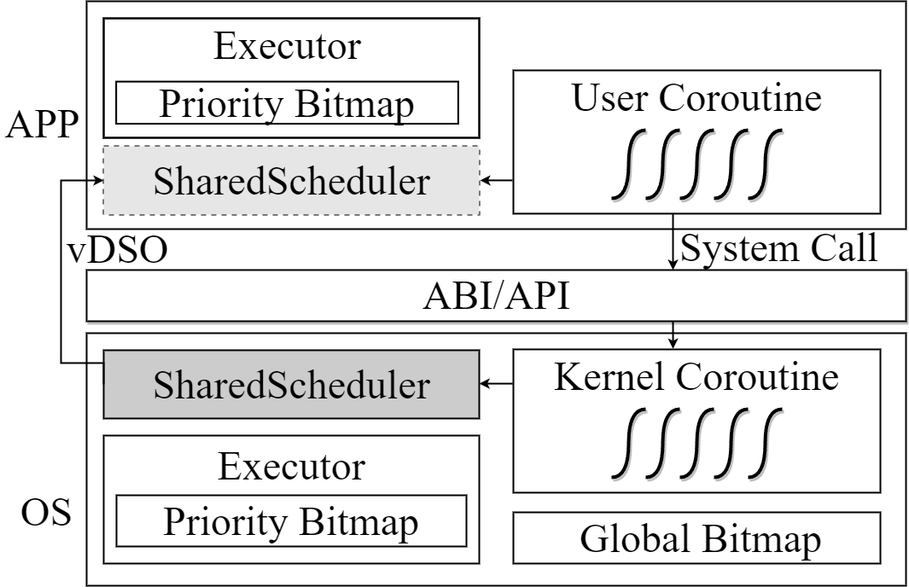
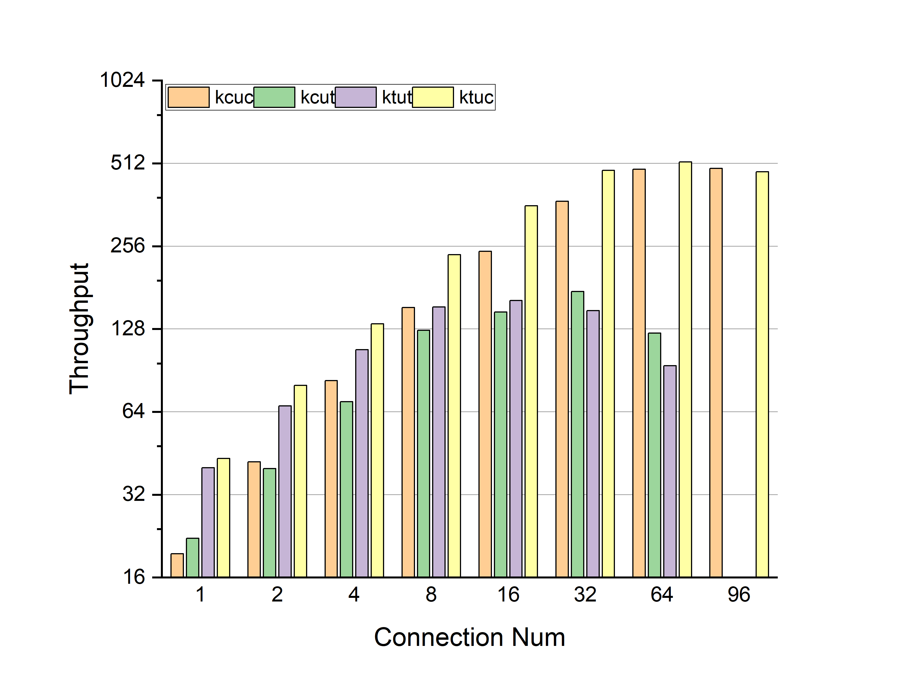
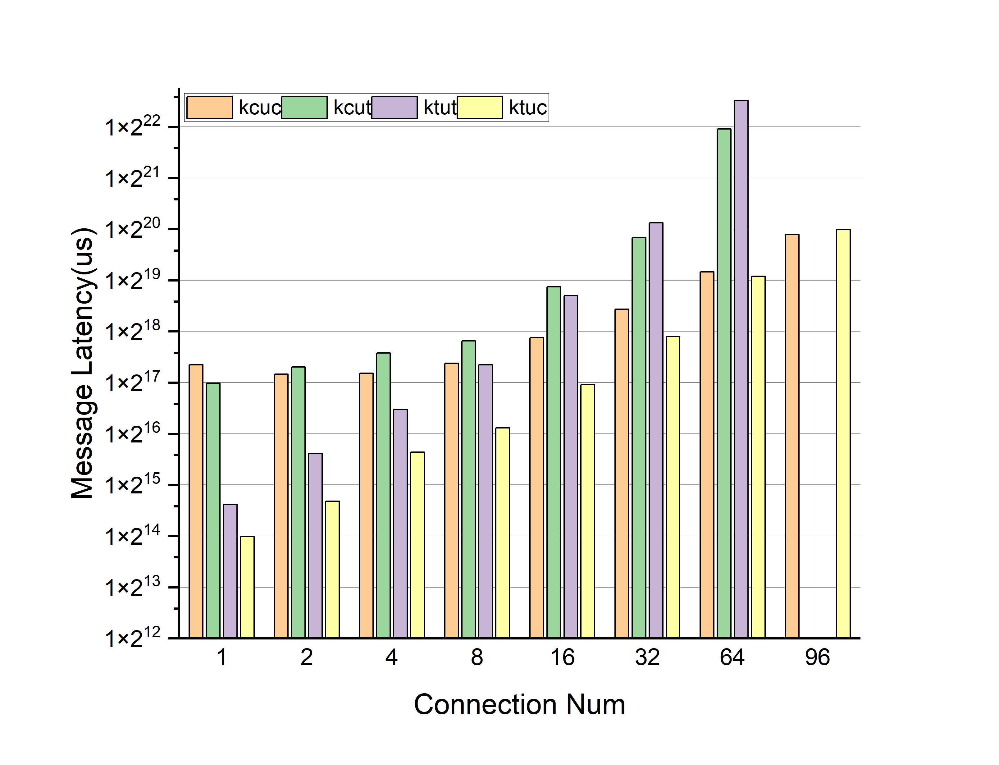

### SharedScheduler：跨特权级的协程调度框架

#### Abstract

本文提出 SharedScheduler，一种跨越特权级的协程调度框架。我们将协程引入到操作系统和应用程序中，作为最小的任务单元，用于替换传统的多线程并发模型。通过给协程附着上优先级，SharedScheduler 能够利用优先级位图机制实现对协程的调度，并且让操作系统能够在一定程度上感知用户态协程，从而实现跨越特权级协调统一调度的目的。为了解决纯用户态协程在面对真正的并发时无力的挑战，我们在 SharedScheduler 中封装了对硬件线程的抽象，并且将协程与异步 I/O 机制结合起来，从而充分利用起多处理器系统的优势。最终，我们构建出一个特定的 web server 应用场景，在 FPGA 平台上对 SharedScheduler 进行了测试，结果证明它的确能够利用优先级实现对协程的精准控制，并且使用协程能够显著减小多线程并发模型带来的开销，使得吞吐量提升 1.5x~2.9x。


#### 1. Introduction

目前的 web server 具有不断增强并发性、可扩展性的需求。大规模的 web server 必须容纳数以万计同时存在的客户端连接，并且不能产生明显的性能下降。截至2022年，谷歌服务器每天处理8830亿次请求，平均每秒处理800万次请求。针对如此大规模的并发程序，多线程模型取得了一定程度上的成功，但随着需求逐步扩大，多线程模型的不合适性逐渐暴露出来。

1）线程作为底层硬件的抽象，是非常不确定的，适合于不确定的并发结构中（加引用 The Problem with Threads），而在 web server 这种并发场景下，需要做的是监听收到的请求包，进行处理并返回结果给客户端，这种确定性的结构，使用多线性模型是非常不合适的。

2）多线程模型很难使用异步 I/O，尽管可以与操作系统底层的事件驱动模型进行结合，但会增加操作系统的复杂性。例如，Linux提供了 [select and epoll](./bibtex_ref/epoll) 等系统调用，通过在单个线程上复用多个I/O操作来支持用户级异步I/O任务。epoll 将多线程模型与事件驱动相结合，但仍需要操作单个线程来轮询多个侦听端口，当没有事件发生时，轮询操作将导致轮询线程被阻塞，直到事件到达并唤醒它。当事件发生时，轮询线程将从内核空间复制相应的侦听端口，并将其发送给单独的线程进行事件处理，这种做法迫使应用程序开发人员采用生产者-消费者模型进行事件分发。Windows 的 [I/O Completion Ports (IOCP)](./bibtex_ref/IOCP) 也提供了类似的I/O多路复用机制，但它更加接近事件驱动模型，在完成I/O操作后调用线程中的回调函数进行后处理工作，使其成为真正的异步 I/O 操作。[Native AIO](./bibtex_ref/nativeAIO) 是内核支持的一组异步 I/O 接口，避免了用户空间和内核之间频繁的切换和数据复制。但是，由于它需要内核支持，因此只能在特定的操作系统体系结构上使用，兼容性较差。而 io_uring 则采用了一种创新的异步方法，允许在用户模式下直接提交 IO 请求，从而消除了在用户和内核空间之间切换上下文的需要。此外，它利用用户模式和内核模式之间的共享内存来防止内存复制，从而提高IO处理效率和吞吐量。然而，过度的设计导致了内核复杂性的增加和使用接口的更大困难。除此之外，还有通过 POSIX 线程接口直接在用户空间实现的异步 I/O 接口 [POSIX AIO](./bibtex_ref/ POSIX - AIO)，它兼容支持 POSIX 标准的不同架构和操作系统。但由于操作系统不知道异步任务，因此有很大的开销，包括线程创建、调度、销毁、I/O缓冲区复制和跨域上下文切换。

3）线程需要占用的资源较多，而纯用户态线程在面对真正的并发时是无能为力的。内核支持的线程需要一套完整的硬件线程抽象（堆栈、通用寄存器、程序计数器等），因此不仅占用的资源较多，且其切换开销较大，在大规模并发时，会带来严重的性能下降。尽管用户态线程能够减少切换开销，增强灵活性，例如 goroutine，但通常是将多个用户态线程映射到一个内核线程上，因此操作系统很难感知用户态线程，不能执行细粒度的资源调度，面对真正的并发时无能为力。

在针对多线程模型不适用于大规模并发的 web server 场景的问题，已经展开了很多研究工作，但大部分仍然选择继续使用线程这个不轻量的抽象，没有从根本上解决问题。除了上述问题，在大规模并发的 web server 程序中还需要异步 I/O 机制的支持，这给操作系统带来了严峻的挑战。操作系统不仅需要给应用程序提供异步 I/O 支持，还需要给自身的一些异步任务构建出一套运行时。尽管已经有相关的研究展开，例如，[LXDs](./bibtex_ref/LXDs) 在内核中开发了一个轻量级的异步运行时环境，用于跨域批处理。这个运行时环境允许在内核中创建轻量级协作线程，这些线程可以异步执行任务，从而提高系统吞吐量；[Memif](./bibtex_ref/ Memif) 是一个用于内存移动的操作系统服务，它提供了一个基于异步和硬件加速实现的低延迟和低开销接口；[Lee等人]((lee2019asynchronous,.md))通过为内核引入异步 I/O 堆栈（AIOS）来减少 I/O 延迟，从而显著提高了应用程序性能；但这些方法通常独立于内核线程调度器之外，导致缺乏通用性和可伸缩性，并且增加了操作系统内核的复杂性。

在本文中，我们提出 SharedScheduler，一种跨越特权级的协程调度框架，用于解决上述的问题。与之前的工作相似，SharedScheduler 使用用户态协程来允许在单个硬件线程抽象上进行多任务并发。而 SharedScheduler 的独特之处在于给协程附着上优先级，并且将其引入到操作系统内，作为基本的任务单元，为操作系统中的所有异步任务提供协调统一的调度框架，对协程进行细粒度的调度，确保系统资源的精准分配。


#### 2. Background And Motivation

近年来，协同程序引起了广泛的关注，例如 DepFast 在分布式仲裁系统中使用协程；Capriccio 使用相互协作的用户态线程来实现可扩展的大规模 web server。根据前人的研究，我们认为协同程序在构建大规模并发程序的场景下是大有作为的。

##### Coroutine

协同程序是一种轻量级的并发编程技术，支持在单个内核线程上协作调度多个执行流。与传统的内核线程或进程相比，协同程序具有更低的资源开销和更高的执行效率。现代的编程语言，如[c++ 20](./bibtex_ref/ pcp -coroutine)、[Go](./bibtex_ref/goroutine)、[Rust](./bibtex_ref/ Rust -async)、[Python](./bibtex_ref/ Python -coroutine)、[Kotlin](./bibtex_ref/ Kotlin -coroutine)等，都为协同程序提供了不同程度的支持，根据协同程序的实现方式，可以划分为以下两类：

1）Stackful：一类为用户态线程，其中以 Go 语言提供的 [Goroutine](./bibtex_ref/ Goroutine) 为代表。Goroutine 是 Go 编程语言中的协同程序实现，它简化并增强了并发编程，允许在单个内核线程内进行大量并发执行。在 Go 语言中，使用 “Go” 关键字后跟一个函数调用来创建 Goroutine。此函数调用与同一地址空间中的其他 Goroutine 并发运行。Goroutine 有自己的运行栈空间，由 Go 语言内集成的运行时动态分配和管理，这个栈空间能够用于保存局部变量和函数调用关系。因此，这类用户态线程相比于内核线程，减少了寄存器切换时的开销，但效果有限。

2）Stackless：另一类则是以 Rust 语言为代表的无栈协程。Rust 语言支持的协程是通过 async/await 语法和相应的运行时库实现的。与用户态线程相比，Rust 协程是作为无栈的，它不需要预先分配固定大小的栈空间。相反，协程的栈空间是根据需求进行动态分配和释放的。这使得协程的创建和销毁非常轻巧和高效。

综合上述分析，我们选择了使用无栈协程来替换传统的多线程模型，将其应用在大规模并发的 web server 场景中，并且由于 Rust 语言编译器的严格检查机制以及内存安全方面的显著优势，我们选择了 Rust 协程。随着对 Rust 协程的进一步了解，我们逐渐认识到协程与异步 I/O 机制之间的紧密关系（加引用），并且 Rust 提供的高级抽象使得系统开发人员能够灵活的定义协程，我们可以在内核中引入与用户态协程一一对应的内核协程，用于处理各种各样的异步任务，从而消除内核底层事件驱动的必要性。这给在操作系统中定义一套统一的异步任务调度机制提供了契机。

##### Motivation

我们针对大规模并发的 web server 场景下的研究，以及学术界和工业界对协程的关注促使我们开始思考重新并发模型和异步框架，寻求能够满足更大规模、更高性能需求的解决方案。为此，我们提出了一个跨越特权级的协程调度框架，让操作系统内核中的异步 I/O 任务与用户态协程的调度能够协调统一，提供一套统一的异步 I/O 框架，同时满足高并发的需求。


#### 3. Design

这一章节将介绍 SharedScheduler 协程调度框架。我们首先将介绍 SharedScheduler 中提供的与协程运行时相关的数据结构，来描述如何实现对协程的调度（Section 3.1）；紧接着，我们将介绍在操作系统内核中引入协程并与异步 I/O 机制结合后，将会产生的影响（Section 3.2）；最后，我们深入到 SharedScheduler 框架的内部，描述它的实现（Section 3.3）。图 1 是 SharedScheduler 的整体框架。

<div>
    <center>
    
    <br>		<!--换行-->
    Figure 1, The architecture of SharedScheduler.
    </center>
</div>

##### 3.1 Coroutine Runtime

Rust 语言提供了两个非常高级的抽象，***Future***和 ***Wake***，以支持协程机制，而不限制具体的运行时实现方式。因此，我们可以利用这个解耦属性来定制一个既可以在内核进程中也可以在用户进程中使用的协程运行时。协程运行时主要由以下两个部分组成：1）Coroutine Control Block；2）Executor。

###### 3.1.1 Coroutine Control Block

Rust 语言提供了 async/await 关键字，使得创建协程非常容易。然而，这种便利意味着协程的执行是模糊和不透明的，协程的控制不能准确地完成。因此，我们在 Rust 语言提供的 Future 和 Waker 抽象的基础上，增加额外的字段组成协程控制块，从而实现对协程的精确控制。以下是协程控制块的结构：

```rust
pub struct Coroutine{
 /// Immutable fields
 pub cid: CoroutineId,
 pub kind: CoroutineKind,
 /// Mutable fields
 pub priority: usize,
 pub future: Pin<Box<dyn Future<Output=()> + 'static + Send + Sync>>, 
 pub waker: Arc<Waker>,
}
```

协程类似于进程和线程。如何推动协程的执行以及如何切换和保存协程的上下文是最重要的问题。幸运的是，Rust 已经提供了两个相对完善的抽象，Future和 Wake。Future 抽象所需的 poll 函数用于推动协程执行，而 Wake 抽象与协程的保存和上下文切换密切相关。协程的执行和上下文切换都是由编译器来帮助我们完成的，并且是透明的。因此，必须在协程控制块中描述 future 和 wake。然而，仅靠这两个字段无法达到精确控制的目的，只能使用粗暴的轮询方式推动协程执行，无法与异步 I/O 机制结合起来，真正发挥出协程的优势。为此，我们在协程控制块中，使用三个额外的字段实现了对协程的精确控制。1）cid 用于标识协程控制块，并且在异步 I/O 机制中发挥关键性的作用；2）Kind 字段用于指示协程任务所属的类型，在推动协程执行到一定阶段后，SharedScheduler 将根据协程的任务类型进行不同的处理；3）Priority 字段表示任务的优先级顺序，作为 SharedScheduler 调度框架的基础。

注意到，我们并没有给协程标注状态字段，因为 Rust 协程的特点，协程只有 pending 或 ready 两种状态，因此，协程所处的状态由它所在的队列隐式的描述。

###### 3.1.2 Executor

Executor 是协程运行时的主要部分，它建立在 Coroutine Control Block 的基础上，负责管理进程内的所有协程。它的主要结构包括以下几个部分：

1）就绪队列与优先级位图：Executor 维护了多个不同优先级下的就绪队列，协程被存储在与其优先级相对应的队列中。这保证了具有最高优先级的协程每次都可以优先执行。此外，Executor 还需要维护与就绪队列对应的优先级位图结构，以指示相应的优先级下是否存在协程，尽管在用户态再额外维护这个结构是多余的，但这个结构是为操作系统内的调度而服务的，操作系统将通过这个数据结构从而获得一定程度上感知用户态协程的能力。

2）阻塞集合：所有执行后处于阻塞状态的协程将由这个结构统一进行管理，直到协程等待的事件出现，再从这个集合中唤醒。

这两个数据结构提供了协程的运行时环境，并且为 SharedScheduler 提供了基本的优先级调度机制，保证了 SharedScheduler 中的协程优先级调度在单个进程地址空间内能发挥作用。

##### 3.2 Combine coroutines with asynchronous I/O mechanisms

将协程与异步 I/O 机制进行结合是 SharedScheduler 的另一个创新点。我们在分析目前内核中的异步 I/O 机制时发现，多线程模型和事件驱动模型均存在一定的缺陷，而在内核中引入协程则恰好可以解决这两个问题，一方面解决了多线程模型资源占用的问题，另一方面，协程同步式的代码风格便于推理控制流的变化，再结合 Executor 中的阻塞集合数据结构，我们可以定义一套统一的异步 I/O 框架。当异步任务阻塞时，对应的协程将会进入阻塞集合中等待事件发生，而事件发生后，原本事件驱动模型中的回调函数将被统一成一种行为，即从阻塞集合中唤醒对应的协程，从而能够复用 SharedScheduler 提供的协程优先级调度。

然而，将协程引入到操作系统内核中的异步 I/O 机制中，替换原有的多线程模型，这无疑给操作系统带来了新的变化，进程以及线程这些基本概念都会发生或多或少的变化，我们需要对这一举动带来的影响进行分析。如果把内核看作一个特殊的进程，并且在全内核隔离机制（加引用）下，进入内核和返回用户进程都需要切换地址空间，所以进程的职责非常明确，用于保证地址空间的隔离。至于线程，它的作用则被大大削弱，不再绑定到一个特定的任务上，只是为协程提供一个运行栈，以及作为提供多处理器系统并行的抽象而存在。因此，传统的线程状态模型将不复存在，取而代之的是协程状态模型。

与线程状态模型类似，协程具有五种基本状态:创建、就绪、运行、阻塞和退出，但还存在一种特殊的状态—运行挂起状态。这是由于操作系统提供的抢占式调度以及一些其他的特殊情况导致的。协程只在处于运行状态时才拥有栈，但处于运行状态的协程可能会被时钟中断、异常或者进入内核执行同步系统调用而打断执行过程，这种情况下，协程将在一定时间尺度上处于占有运行栈，但已经不处在 CPU 上执行的状态，因此我们将其定义为运行挂起状态，根据产生原因可将其进一步划分为运行中断状态和运行异常状态。协程状态转换模型如图3所示。

<div>
    <center>
    
    <br>		<!--换行-->
    Figure 2, Coroutine state transition model. 	<!--标题-->
    </center>
</div>

１）一旦创建了协程，它就进入就绪状态，直到它被调度，从而进入运行状态。

２）对于处于运行状态的协程，可能的状态转换可以分为两类。一方面，它可能等待某个事件进入阻塞状态，或者检测到其他优先级更高的协程(包括其他进程中的协程)而主动让权进入就绪状态。这个状态转换不会占用运行栈；另一方面，如果在运行过程中发生中断或异常，CPU　将被抢占，当前协程将进入运行挂起状态。此外，当任务完成时，正在运行的协程将进入退出状态，等待回收资源。

３）当协程处于阻塞状态时，它必须等待一个事件唤醒自己，从而进入就绪状态。但是，当协程处于运行挂起状态时，它不需要经过就绪状态转换，只需要等待事件发生即可直接进入运行状态。

##### 3.3 SharedScheduler Internals

SharedScheduler 在基本的协程优先级调度的基础上，还提供了更高级的优先级协调调度：操作系统内核与用户进程协调调度以及用户进程之间协调调度。3.1.2 节中提到的优先级位图在这个过程中起到了关键性的作用。

首先是在内核中的协程与用户进程内的协程之间的协调。我们让操作系统在处理时钟中断时，扫描用户进程 Executor 中的优先级位图，生成全局优先级位图，从而让操作系统能够在一定程度上感知用户态协程。而操作系统内核中同样存在 Executor 来管理内核中的协程。将全局优先级位图与内核 Executor 中的优先级位图相结合，即可实现操作系统与用户进程之间的协调。最直接的做法是再单独定义一套内核中的调度机制，保证内核中优先级高的协程先执行，再来确定用户进程的执行。这样额外的机制显得格格不入，最后，我们发现只需在内核中引入一个特殊的协程——切换协程，便可以沿用 SharedScheduler 的基本协程优先级调度机制。切换协程的职责是切换到具有最高优先级的进程，其特殊性在于它是一个永远不会结束的协程，只要存在用户进程，它就必须存在。内核在扫描完优先级位图之后，即可确定切换协程的优先级，从而与内核中其他的协程相统一，保证操作系统内核与用户进程之间的跨越特权级的协调。

此外，我们将上述的全局优先级位图的只读权限共享给用户进程，从而实现不同进程内协程之间的协调，用户进程在运行过程中一旦检测到操作系统或者其他进程中存在更高优先级的协程存在，就会主动让出 CPU，从而实现相互协调。

通过上述的几种机制，SharedScheduler 为操作系统提供了一种跨越特权级的协程调度框架，图 4 展示了使用 SharedScheduler 后，操作系统与用户进程的控制逻辑。

<div>
    <center>
    
    <br>		<!--换行-->
    Figure 3, Sharedscheduler's Control logic. 	<!--标题-->
    </center>
</div>


#### 4. Build concurrent and asynchronous program with SharedScheduler

为了方便应用程序开发者使用 SharedScheduler 来构建高并发异步程序，我们提供了一组完善的编程接口和异步系统调用接口。

##### 4.1 The Interface of SharedScheduler

为了保证应用程序开发与传统方式相兼容，我们对用户进程的类 unix 运行时环境进行了兼容性调整，main 函数不会在用户进程初始化后马上执行，而是被封装到协程（main 协程），并被添加到就绪队列中进行统一调度。这意味着在用户进程初始化后，所有的任务都是以协程的形式存在，处于相互协调的执行环境中。而 main 协程中需要做的是调用 SharedScheduler 的接口，创建不同的协程。而协程的运行则由 SharedScheduler 提供的协程运行时在背后透明的推动。SharedScheduler 给应用程序开发者提供了以下接口：

| Interface                                                    | Description                                                  |
| ------------------------------------------------------------ | ------------------------------------------------------------ |
| spawn(future: Pin<Box<dyn Future<Output=()> + 'static + Send + Sync>>,  prio: usize) | Create a new coroutine with specific priority                |
| getcid()                                                     | Get the Id of current coroutine.                             |
| wake(cid: CoroutineId)                                       | Wake up the specific coroutine.                              |
| reprio(cid: CoroutineId, prio: usize)                        | Adjust the priority of the target coroutine.                 |
| alloc_cpu()                                                  | Allocate more cpu to support a higher degree of concurrency. |

##### 4.2 Asynchronous system call

除了提供编程接口方便替换原本的线程模型，我们还需要将协程与异步 I/O 机制结合起来，让协程的优势得到充分发挥。倘若在协程中使用同步的 IO 系统调用，例如 “read”，那么这个操作将阻塞所有能够此运行栈上运行的就绪协程，从而限制了并发程度。因此需要将系统调用转换为异步的形式，确保只会阻塞当前的协程，而其他的就绪协程能够继续得到推进。对异步 IO 系统调用的支持主要涉及两个部分：提供给应用程序的系统调用接口以及内核中的支持。

统一同步和异步系统调用接口：为了保证系统调用能够支持异步的特性，我们添加了一个实现了 Rust 语言 `Future ` 抽象的 `Asyncall` 辅助数据结构，而这个数据结构将会根据系统调用的返回值决定是否需要异步的等待。此外，我们利用了 Rust 语言中的宏这个机制，保证了同步和异步系统调用在形式上的统一。两者之间的区别在于异步系统调用还需要一个额外的参数。格式如下表所示：

```rust
read!(fd, buffer, cid); // Async call
read!(fd, buffer); // Sync call
```

内核异步 I/O 支持：在执行异步系统调用时，内核将会创建一个与用户态协程对应的内核协程，但不会马上执行，而控制流则会马上返回到用户态，将当前的协程阻塞，使得用户态的其他就绪协程能够继续执行。一旦内核执行完协程，完成对应的异步处理后，它将通过系统调用传递的协程 Id 唤醒相应的用户态协程。下面，我们将以使用套接字异步读取数据为例，解释协程如何与异步 I/O 机制结合。

<div>
    <center>
    
    <br>		<!--换行-->
    Figure 4, Asynchronous system call. 	<!--标题-->
    </center>
</div>

进入内核后，原先由内核同步完成的操作将被封装到内核协程中等待执行。然后，控制流将立即返回到用户态并让当前的协程阻塞，等待内核处理完成后再被唤醒。此时，SharedScheduler 将切换并执行下一个用户协程。而内核中的协程则会在另一个 CPU 上执行，如果这个缓冲区中的数据已经准备好，那么它不需要等待，这样则可以充分利用多处理器的优势；如果缓冲区中的数据尚未准备好，那么它将被阻塞，等待网卡接收到数据被唤醒，而其他的内核协程则能够继续执行。一旦内核收到网卡产生的中断，将缓冲区的数据准备好之后，那么对应的内核协程将被唤醒以继续执行。一旦内核协程完成工作(在本例中，将数据复制到用户空间缓冲区)，它将生成一个用户态中断，告知用户态中断处理程序唤醒相应的协程。


#### 5. Performance Evaluation

为了证实 SharedScheduler 在构建高并发异步程序上的有效性，以及对协程更加精确的控制，我们使用 rocket-chip 在 FPGA 中搭建了一个 RISC-V 五级流水处理器，并在其中运行了基于 SharedScheduler 框架实现的操作系统，最终通过模拟现实中的 web server 应用场景，完成了对 SharedScheduler 的评估。

实验环境：开发板型号为 axu15eg，搭载的 FPGA 型号为 Zynq UltraScale+ XCZU15EG-2FFVB1156 MPSoC，其中 RISC-V 子系统配置参数为：

| cores | Frequency | BTB entries | L2 cache size | Memory size |
| :---: | :-------: | :---------: | :-----------: | :---------: |
|   2   |  100MHz   |     40      |      2MB      |     2GB     |

使用的外设为：

| 网卡 | Xilinx AXI 1G/2.5G Ethernet Subsystem |
| :--: | :-----------------------------------: |
| DMA  |       Xilinx AXI DMA Controller       |

模拟的 web server 应用场景由两部分组成，一部分是运行在 PC 上的客户端，定期向服务端发送一定长度的矩阵数据，并接收来自服务器的响应；另一部分则是在 FPGA 中的服务器，它与客户端之间建立连接，并做出响应。服务器由主要有以下三个功能：

1）Receive request：接收来自客户端的请求并存储在请求队列中；

2）Handle Request：从请求队列中取出请求，执行矩阵运算，并将结果存储到响应队列；

3）Send response：从响应队列中取出响应消息，并将其发送到客户端。

最终在 PC 上的客户端将计算每次发出请求到接收响应这个过程中的时间延迟并统计在固定时间内收发消息的吞吐量。我们通过分析在不同配置的情况下，web server 的时间延迟和吞吐量完成对 SharedScheduler 的评估。

##### 5.1 Coroutine vs. thread

为了证实协程模型具有更高的并发性，我们分别使用协程和线程来实现上述 web server 服务器的三个功能，前者针对客户端与服务器的每条连接创建出 3 个协程，而后者则是为每条连接创建 3 个线程。客户端与服务器之间的所有连接全部建立完成之后，才开始进行测量，以 100ms 为周期向服务器发送一次请求，消除协程/线程创建带来的影响。我们分别针对 8x8 和 12x12 这两种矩阵规模，进行了衡量，最终的实验结果如下：

<div>
    <center>
        <div>
            
            <br>
            Figure 5, Throughput,coroutine vs thread. 	<!--标题-->
        </div>
    	<div>
            
            <br>
            Figure 6, Latency,coroutine vs thread. 	<!--标题-->
        </div>
    </center>
</div>

从图中可以看出，当连接数较少时，线程模型的消息延迟略低于协程。这是因为当连接数量较少时，内核可以直接调度线程来执行任务，而协程模型则是由于 SharedScheduler 中额外的同步互斥操作，导致延迟略高。随着连接数的增加，线程模型的延迟迅速增加，并且远远高于协程模型的延迟。这是因为大多数协程切换不需要被捕获到内核中，只需要切换函数堆栈，从而产生比线程小得多的切换开销。比较同一模型下不同的矩阵规模，发现矩阵规模越大，延迟越高，这是由于更大的矩阵规模，消息收发和消息处理的开销更大，因此延迟增加是符合预期的，但不影响线程与协程之间的比较。

图中还显示了不同模型下不同矩阵规模的总吞吐量测试结果。可以看出，协程模型下服务器的总吞吐量随着连接数的增加基本呈现出线性增加的趋势，即使在矩阵规模增大的情况下也是如此。对于线程模型下的服务器，在连接数较少的情况下，其吞吐量高于协程模型，但随着连接数的增加，其切换开销迅速增加，导致总吞吐量增长趋势放缓。当连接数在 8 左右时，其吞吐量几乎不再增长。

##### 5.2 Priority orientation

在现实场景下，web server 需要承载数以万计的连接，但其中可能有很大一部分连接是空闲的，因此，在这种场景下，系统内的资源应该偏向于那些活跃的连接，需要优先保证这些连接能够得到及时的响应。因此，我们以分层的方式设置每个连接的优先级级别，以确保优先级高的连接具有较低的延迟，并且延迟抖动较小。与上述实验类似，但服务器是使用协程和 SharedScheduler 实现的，我们在客户端和服务器之间建立 8 条连接，平均划分为 8 个优先级，测试在同一时间段内，不同优先级连接的吞吐量和消息延迟。测试结果如下图所示，在有限的资源约束下，具有较高优先级级别（较低优先级编号）连接的吞吐量和时间延迟能够得到保证。随着资源数量的增加，低优先级的连接也能获得更高的吞吐量和更低的延迟，同时具有最高优先级的连接仍然具有最高的吞吐量和最低的时间延迟。

<div>
    <center>
        <div>
            
            <br>
            Figure 7, Throughput of different priority connections. 	<!--标题-->
        </div>
    	<div>
            
            <br>
            Figure 8, Latency of different priority connections. 	<!--标题-->
        </div>
    </center>
</div>

此外，我们在客户端和服务器之间建立 8 条连接，平均划分为 4 个优先级，针对每个优先级连接的时间延迟分布进行了分析，最终结果如下图所示。这符合优先处理高优先级连接的特点，高优先级连接的时延分布较为集中且时延低，而低优先级连接的时延则比较分散且时延高。而随着资源增加，所有优先级的时延都减小且分布集中。

<div>
    <center>
        <div>
            
            <br>
            Figure 9, Latency distribution of different priority connections in case of 2 core. 	<!--标题-->
        </div>
    	<div>
            
            <br>
            Figure 10, Latency distribution of different priority connections in case of 4 core 	<!--标题-->
        </div>
    </center>
</div>

综合上述两类实验的结果，我们可以得出 SharedScheduler 框架在构建高并发应用程序中能够发挥一定作用，在规模较大时，使用协程时的吞吐量能够达到使用线程的 1.5x~2.9x，并且 SharedScheduler 框架提供的协程优先级调度能够很好的应对不同的需求，保证系统资源能够合理分配。尽管我们的实验测试的负载较小，但我们相信，即使在高负载的场景下，SharedScheduler 框架也会有更好的表现。


#### 6. Conclusion

本文提出了 SharedScheduler，一种跨越特权级的协程调度框架。SharedScheduler 能够帮助我们开发高并发的应用程序，减小传统多线程模型的开销，并且提供了方便的异步 I/O 机制和优先级调度机制，保证了系统资源能够合理分配。我们今后还将考虑将 SharedScheduler 与用户态中断机制进行进一步的结合。

