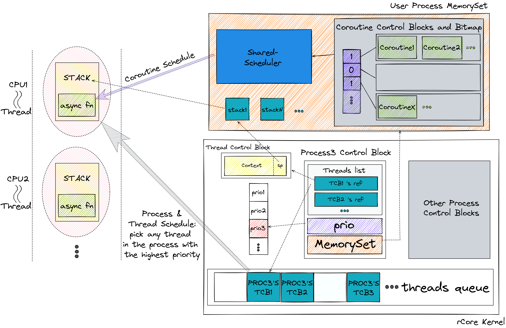

##### 20230131
- 修改第一幅图
	- 图中表达了进程主要负责地址空间隔离，线程提供给协程运行的栈，协程则是最小的任务单元
	- 两级调度：进程、线程的调度合并在一起，称之为一级调度（每个进程控制块中的优先级字段记录了当前进程内所有协程的优先级中的最高者，每次进行一级调度时，在最高优先级的进程的所有线程中，选出在就绪线程队列中位置靠前的一个线程执行），实际上是两者有区别，进程调度会导致地址空间切换，而线程调度则是在同一个地址空间中的栈切换；协程调度则是完全在用户态进行，每次选出优先级最高的协程
	- 把线程看作是分配给进程的虚拟的 CPU

- 修改第二幅图
	- 双向箭头表示上下文切换
	- 单向箭头表示控制流切换
	- 有颜色的箭头表示切换的不同情况
	- 线程外的控制流切换由中断/异常或者主动让权引起，可以分为两种情况，一种是切换到同一进程内的线程，这种情况需要保存 `Thread Context`，最明显的特征是切换栈，另一种是切换到其他进程的线程，这需要保存所有的寄存器 `CPU Context`，明显的特征是需要切换地址空间
		- 中断/异常造成的控制流切换可以发生在任何时刻，因此有四个（红绿）箭头
		- 主动让权则只能发生在执行完某个协程之后，因此有两个（红绿）箭头
	- 线程内的控制流切换即协程切换，既不切换地址空间也不切换栈，只会切换协程的上下文

##### 20230130
- 和老师讨论了两幅图的问题
- 用 obsidian 中的 excalidraw 插件画图，自动生成 png 图片，使得文字和图片都在同一个软件中进行修改，保证一致性
- 修改图片